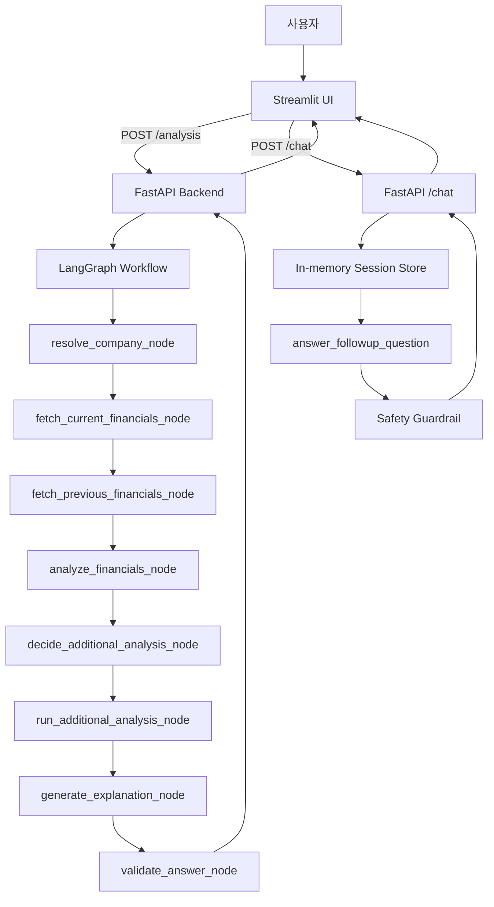

# 공시톡: DART 재무제표 분석 챗봇

공시톡은 사용자가 기업명, 사업연도, 보고서 종류를 입력하면 OpenDART 공시 데이터를 조회하고, 핵심 재무 수치와 재무비율을 계산한 뒤 초보자도 이해하기 쉬운 해설과 추가 질문 답변을 제공하는 웹 애플리케이션이다.

본 프로젝트는 투자 추천 서비스가 아니다. 매수, 매도, 종목 추천, 목표주가, 수익률 예측은 제공하지 않고, 공시 기반 재무정보 해설에만 초점을 둔다.

## 1. 구현 범위

현재 구현된 기능은 다음과 같다.

- Streamlit 기반 프론트엔드 화면
- FastAPI 기반 백엔드 API
- OpenDART 기업 고유번호 조회 및 CSV 캐싱
- OpenDART 단일회사 주요계정 재무제표 조회
- 핵심 재무 수치 추출
- 재무비율 및 전년 대비 성장률 계산
- 위험 신호 탐지
- LangGraph 기반 분석 workflow
- Upstage Solar 모델 기반 AI 재무 해설
- LLM 기반 추가 분석 필요 여부 판단 및 규칙 기반 fallback
- 분석 결과 기반 추가 질문 채팅
- 최근 분석 세션 목록과 세션 상세 조회
- 기업명 검색 실패 시 LLM 기반 기업명 후보 제안
- 투자 추천성 질문 탐지 및 답변 안전장치
- 백엔드/프론트엔드 콘솔 로깅
- pytest 기반 단위/엔드포인트 테스트

## 2. 사용자 흐름

1. 사용자는 Streamlit 사이드바에서 기업명, 사업연도, 보고서 종류를 입력한다.
2. `분석하기`를 누르면 프론트엔드가 임시 분석 세션을 만들고 분석 진행 화면을 보여준다.
3. FastAPI 백엔드는 LangGraph workflow를 실행한다.
4. workflow는 기업 후보 조회, DART 재무제표 조회, 수치 추출, 비율 계산, 위험 신호 탐지, 추가 분석 판단, AI 해설 생성을 순서대로 수행한다.
5. 분석이 완료되면 백엔드는 세션을 생성하고 분석 컨텍스트를 반환한다.
6. Streamlit은 결과 대시보드, 차트, 원본 주요계정 일부, AI 해설을 표시한다.
7. 사용자는 저장된 분석 결과를 바탕으로 추가 질문을 할 수 있다.
8. 최근 대화 목록에서 이전 분석 세션을 다시 열 수 있다.

## 3. 시스템 구조

```text
사용자
  ↓
Streamlit Frontend (app.py, ui/)
  ├─ 분석 조건 입력
  ├─ 분석 진행 화면
  ├─ 결과 대시보드
  ├─ 전년 대비 차트
  ├─ ChatGPT형 추가 질문 UI
  └─ 최근 대화 목록
  ↓ HTTP
FastAPI Backend (backend/main.py)
  ├─ API endpoint
  ├─ LangGraph Workflow (src/workflow.py)
  ├─ OpenDART Client (src/dart_client.py)
  ├─ Financial Analyzer (src/financial_analyzer.py)
  ├─ Upstage LLM Client (src/llm_client.py)
  ├─ Safety Guardrail (src/safety.py)
  └─ In-memory Session Store (backend/session_store.py)
```

## 4. AI Workflow

분석 로직은 `src/workflow.py`에 LangGraph workflow로 분리되어 있다. 각 node는 독립 함수라 테스트하기 쉽고, FastAPI는 workflow 결과를 Streamlit이 렌더링하기 쉬운 응답 구조로 변환한다.

### Workflow State

| 필드 | 의미 |
| --- | --- |
| `company_name` | 사용자가 입력한 기업명 |
| `year` | 사업연도 |
| `report_code` | DART 보고서 코드 |
| `report_name` | 화면 표시용 보고서 이름 |
| `corp_code` | DART 기업 고유번호 |
| `selected_company` | 최종 선택된 기업 정보 |
| `candidate_companies` | 기업명 검색 후보 목록 |
| `current_df` | 현재 연도 주요계정 DataFrame |
| `previous_df` | 전년도 주요계정 DataFrame |
| `numbers` | 핵심 재무 수치 |
| `previous_numbers` | 전년도 핵심 재무 수치 |
| `ratios` | 재무비율 |
| `growth` | 전년 대비 증가율 |
| `risk_signals` | 추가 확인이 필요한 위험 신호 |
| `agent_decision` | 추가 분석 필요 여부와 분석 타입 |
| `additional_analysis` | 추가 분석 섹션 |
| `explanation` | AI 해설 |
| `error` | workflow 중단 사유 |

### Node 구성

1. `resolve_company_node`
   - 기업명으로 DART 기업 후보를 조회한다.
   - 상장회사 후보를 우선 정렬하고 첫 번째 후보를 선택한다.
   - 후보가 없으면 error state를 반환한다.

2. `fetch_current_financials_node`
   - 선택된 `corp_code`, `year`, `report_code`로 현재 연도 주요계정을 조회한다.
   - 현재 연도 데이터 조회 실패는 분석 실패로 처리한다.

3. `fetch_previous_financials_node`
   - 전년도 주요계정을 조회한다.
   - 전년도 데이터는 비교용이므로 실패해도 workflow를 계속 진행한다.

4. `analyze_financials_node`
   - 핵심 수치를 추출한다.
   - 재무비율과 전년 대비 성장률을 계산한다.
   - 위험 신호를 탐지한다.

5. `decide_additional_analysis_node`
   - LLM 또는 규칙 기반 fallback으로 추가 분석 필요 여부를 판단한다.
   - 허용 타입은 `debt_risk`, `profitability`, `growth`, `capital_structure`, `raw_account_review`이다.

6. `run_additional_analysis_node`
   - 판단 결과에 따라 부채 안정성, 수익성, 성장성, 자본 구조, 원본 계정 확인 섹션을 생성한다.

7. `generate_explanation_node`
   - Upstage Solar 모델을 호출해 초보자용 재무 해설을 생성한다.
   - `UPSTAGE_API_KEY`가 없으면 LLM 호출 없이 안내 메시지를 반환한다.

8. `validate_answer_node`
   - AI 답변을 안전장치에 통과시켜 투자 추천성 표현을 완화하고 면책 문구를 보장한다.



## 5. FastAPI API

| Method | Path | 설명 |
| --- | --- | --- |
| `GET` | `/health` | 백엔드 상태 확인 |
| `POST` | `/analysis` | 재무 분석 workflow 실행 |
| `POST` | `/chat` | 저장된 분석 결과 기반 추가 질문 답변 |
| `POST` | `/suggest` | 기업명 검색 실패 시 후보 기업명 제안 |
| `GET` | `/sessions` | 인메모리 세션 목록 조회 |
| `GET` | `/sessions/{session_id}` | 특정 세션의 분석 결과와 채팅 기록 조회 |

`POST /analysis` 요청 예시:

```json
{
  "company_name": "삼성전자",
  "year": 2024,
  "report_code": "11011",
  "report_name": "사업보고서"
}
```

분석 응답에는 `session_id`, 선택 기업 정보, 후보 기업 목록, 핵심 수치, 전년도 수치, 성장률, 재무비율, 위험 신호, 추가 분석 결과, 원본 주요계정 일부, AI 해설이 포함된다.

## 6. 재무 데이터 처리

### OpenDART 사용 API

- `corpCode.xml`: 전체 기업 고유번호 ZIP/XML 다운로드
- `fnlttSinglAcnt.json`: 단일회사 주요계정 재무제표 조회

기업 고유번호 데이터는 `data/corp_codes.csv`에 캐싱한다. 캐시가 있으면 다시 다운로드하지 않고, 캐시가 없거나 강제 갱신할 때만 OpenDART를 호출한다.

보고서 코드:

| 보고서 종류 | 코드 |
| --- | --- |
| 사업보고서 | `11011` |
| 반기 | `11012` |
| 1분기 | `11013` |
| 3분기 | `11014` |

### 추출하는 핵심 수치

- 매출액
- 영업이익
- 당기순이익
- 자산총계
- 부채총계
- 자본총계

기업마다 계정명이 다를 수 있으므로 여러 후보명을 두고 매칭한다. `fs_div`가 `CFS`인 연결재무제표를 우선 사용하고, 없으면 `OFS` 개별재무제표를 사용한다.

### 계산하는 비율

| 지표 | 계산식 |
| --- | --- |
| 영업이익률 | 영업이익 / 매출액 |
| 순이익률 | 당기순이익 / 매출액 |
| ROE | 당기순이익 / 자본총계 |
| 부채비율 | 부채총계 / 자본총계 |
| 자기자본비율 | 자본총계 / 자산총계 |
| 전년 대비 증가율 | `(현재 연도 값 - 전년도 값) / 전년도 값` |

분모가 없거나 0이면 무리하게 계산하지 않고 `데이터 없음` 또는 `추가 확인 필요`로 표시한다.

### 위험 신호 예시

- 부채비율 200% 초과
- 영업이익률 음수
- 순이익률 음수
- 자본총계 0 이하 또는 없음
- 매출액 없음 또는 0

## 7. LLM 및 안전장치

LLM은 Upstage Solar를 OpenAI-compatible SDK 방식으로 호출한다.

사용 환경변수:

- `UPSTAGE_API_KEY`
- `UPSTAGE_BASE_URL`
- `UPSTAGE_MODEL`

프롬프트 원칙:

- 제공된 숫자와 계산 결과만 사용한다.
- 숫자가 없는 항목은 추측하지 않는다.
- 전년 대비 증가를 무조건 긍정적으로 해석하지 않는다.
- 투자 추천, 매수/매도 의견, 목표주가, 수익률 예측은 하지 않는다.
- 초보자도 이해할 수 있게 설명한다.

안전장치:

- `detect_investment_advice_request(text)`로 투자 추천성 질문을 탐지한다.
- `investment_advice_redirect_answer()`로 투자 판단 대신 재무지표 확인 관점으로 우회한다.
- `sanitize_financial_answer(answer)`로 매수/매도 추천처럼 보일 수 있는 문장을 완화한다.
- 모든 해설에는 다음 면책 문구를 포함한다.

> 본 서비스는 투자 추천이 아닌 공시 기반 재무정보 해설 도구입니다.

## 8. Streamlit UI

Streamlit 프론트엔드는 `app.py`와 `ui/` 패키지로 나뉘어 있다.

- `ui.analysis`: 분석 요청, 진행 화면, 결과 대시보드 렌더링
- `ui.api`: FastAPI HTTP 통신
- `ui.chat`: 추가 질문 채팅 UI
- `ui.session`: 세션 캐시, 최근 대화 목록, 임시 분석 세션 관리
- `ui.formatting`: 금액/비율 포맷팅과 표/차트 데이터 생성
- `ui.styles`: 채팅 UI 스타일
- `ui.scroll`: 분석 완료 후 스크롤 보조
- `ui.config`: 화면 표시용 상수와 백엔드 URL 설정

주요 화면 요소:

- 분석 조건 사이드바
- 분석 진행 패널
- 기업 후보/선택 기업 정보
- 핵심 재무 수치 표
- 재무비율 표
- 핵심 수치 차트
- 전년 대비 성장성 표와 비교 차트
- 위험 신호 영역
- AI 추가 분석 영역
- DART 주요계정 원본 일부 보기
- AI 분석 결과
- 추천 질문 칩과 추가 질문 입력창
- 최근 대화 목록

## 9. 로깅

시연 영상에서 백엔드와 프론트엔드의 동작 흐름이 보이도록 콘솔 로깅을 추가했다.

공통 설정은 `src/logging_config.py`에서 관리한다. 로그 기본 레벨은 `INFO`이며, `GONGSITALK_LOG_LEVEL` 환경변수로 변경할 수 있다.

로그 형식:

```text
HH:MM:SS | service | 레벨 | 메시지
```

예시:

```text
14:05:11 | backend | 정보 | 분석 요청 접수 | 기업=삼성전자 | 연도=2024 | 보고서코드=11011
14:05:11 | backend | 정보 | 기업 선택 완료 | 기업=삼성전자 | 고유번호=00126380 | 후보=10개
14:05:12 | backend | 정보 | DART 주요계정 조회 완료 | 고유번호=00126380 | 연도=2024 | 행=33개
14:05:13 | frontend | 정보 | 분석 결과 저장 | 세션=... | 기업=삼성전자 | 메시지=0개
```

백엔드에서 확인할 수 있는 로그:

- 분석 요청 접수와 세션 생성
- `/analysis`, `/chat`, `/suggest`, `/sessions` 처리 흐름
- LangGraph workflow 주요 단계 완료/실패
- DART 캐시 사용, API 호출 대상, 반환 row 수
- LLM 호출 여부, fallback 여부, 응답 길이
- 세션 생성과 채팅 메시지 누적

프론트엔드에서 확인할 수 있는 로그:

- 분석 form 제출
- 임시 분석 세션 생성/정리
- 백엔드 `GET`/`POST` 요청 시작/완료/실패
- 분석 결과 세션 저장
- 추가 질문 제출과 응답 저장
- 최근 대화 목록 및 세션 상세 로딩

기본 `INFO` 레벨에서는 시연에 필요한 핵심 흐름만 출력한다. HTTP 시작/완료, 캐시 hit 같은 세부 로그까지 보고 싶으면 `GONGSITALK_LOG_LEVEL=DEBUG`로 실행한다.

API 키, DART 인증키, Upstage 인증키, 전체 프롬프트 원문은 로그에 남기지 않는다. 프론트엔드 화면에는 내부 예외 문자열이나 OpenDART 상태 코드 대신 사용자가 조치할 수 있는 한국어 안내 문구를 표시한다.

## 10. 실행 방법

가상환경 생성 및 패키지 설치:

```bash
python -m venv .venv
pip install -r requirements.txt
```

Windows PowerShell:

```powershell
python -m venv .venv
.\.venv\Scripts\Activate.ps1
pip install -r requirements.txt
```

FastAPI 백엔드 실행:

```bash
uvicorn backend.main:app --reload --port 8000
```

Streamlit 프론트엔드 실행:

```bash
streamlit run app.py
```

기본 접속 주소:

- Streamlit: `http://localhost:8501`
- FastAPI: `http://localhost:8000`
- FastAPI 문서: `http://localhost:8000/docs`

시연 영상 촬영 시에는 터미널을 두 개 열어 백엔드와 프론트엔드 로그를 함께 보여주면 된다.

PowerShell 예시:

```powershell
$env:GONGSITALK_LOG_LEVEL="INFO"
uvicorn backend.main:app --reload --port 8000
```

```powershell
$env:GONGSITALK_LOG_LEVEL="INFO"
streamlit run app.py
```

## 11. 환경변수

프로젝트 루트에 `.env` 파일을 만들고 다음 값을 설정한다.

```env
DART_API_KEY=your_opendart_api_key_here
UPSTAGE_API_KEY=your_upstage_api_key_here
UPSTAGE_BASE_URL=https://api.upstage.ai/v1
UPSTAGE_MODEL=solar-pro3
GONGSITALK_BACKEND_URL=http://localhost:8000
GONGSITALK_LOG_LEVEL=INFO
```

- `.env`는 `.gitignore`에 포함되어야 한다.
- API 키는 코드에 하드코딩하지 않는다.
- `UPSTAGE_API_KEY`가 없어도 DART 기반 수치 분석은 가능하지만 AI 해설과 추가 질문 답변은 fallback 안내로 대체된다.

## 12. 테스트

전체 테스트 실행:

```bash
python -m pytest
```

현재 테스트 범위:

- DART 기업코드 XML/ZIP 파싱
- DART 주요계정 API 성공/오류 mock
- 핵심 재무 수치 추출
- 재무비율 및 성장률 계산
- 위험 신호 탐지
- LLM 호출 mock
- 추가 분석 라우팅 fallback
- 투자 추천 안전장치
- LangGraph workflow node
- FastAPI analysis/chat/session endpoint

## 13. 프로젝트 구조

```text
asm-ai-18team/
├── app.py
├── backend/
│   ├── __init__.py
│   ├── main.py
│   ├── schemas.py
│   └── session_store.py
├── docs/
│   └── BACKEND_BRANCH_STRATEGY.md
├── src/
│   ├── __init__.py
│   ├── dart_client.py
│   ├── financial_analyzer.py
│   ├── llm_client.py
│   ├── logging_config.py
│   ├── safety.py
│   ├── utils.py
│   └── workflow.py
├── tests/
│   ├── test_backend.py
│   ├── test_dart_client.py
│   ├── test_financial_analyzer.py
│   ├── test_llm_client.py
│   ├── test_safety.py
│   ├── test_utils.py
│   └── test_workflow.py
├── ui/
│   ├── __init__.py
│   ├── analysis.py
│   ├── api.py
│   ├── chat.py
│   ├── config.py
│   ├── formatting.py
│   ├── scroll.py
│   ├── session.py
│   ├── styles.css
│   └── styles.py
├── .env.example
├── .gitignore
├── README.md
└── requirements.txt
```

## 14. 한계점

- OpenDART 주요계정 API의 계정명은 기업별로 달라 모든 기업의 수치 추출을 완벽히 보장하지 않는다.
- 전년도 데이터가 없거나 보고서 종류가 다르면 성장률 비교가 제한된다.
- 현재 AI 해설은 주요계정과 계산 결과 중심이며, 사업보고서 전문과 주석 전체를 분석하지 않는다.
- 세션 기록은 인메모리 방식이므로 백엔드를 재시작하면 사라진다.
- 주가, 시장 상황, 산업 전망, 거시경제 정보는 분석 대상에 포함하지 않는다.
- 투자 추천, 목표주가, 수익률 예측 기능은 의도적으로 제공하지 않는다.

## 15. 향후 개선 방향

- 재무제표 계정명 매칭 규칙 고도화
- 현금흐름표, 주석, 사업보고서 텍스트 분석 추가
- 여러 기업 비교 기능
- SQLite 또는 DB 기반 영구 세션 저장
- 분석 결과 신뢰도와 추출 근거 표시
- 사용자가 직접 기업 후보를 선택하는 기능
- 시연/운영용 로그 파일 저장 옵션
- 안전장치 테스트 케이스 확대

## 16. Docker 실행

프론트엔드(Streamlit)와 백엔드(FastAPI)를 한 번에 실행하려면 프로젝트 루트에 `.env` 파일을 준비한 뒤 아래 명령을 실행한다.

```bash
docker compose up --build
```

기본 접속 주소:

- Streamlit: `http://localhost:8501`
- FastAPI: `http://localhost:8000`
- FastAPI 문서: `http://localhost:8000/docs`

Docker Compose 안에서는 프론트엔드가 `GONGSITALK_BACKEND_URL=http://backend:8000`으로 백엔드 컨테이너에 연결한다. `data/` 디렉터리는 컨테이너에 마운트되어 OpenDART 기업 코드 캐시가 재시작 후에도 유지된다.

백그라운드 실행:

```bash
docker compose up --build -d
```

종료:

```bash
docker compose down
```
