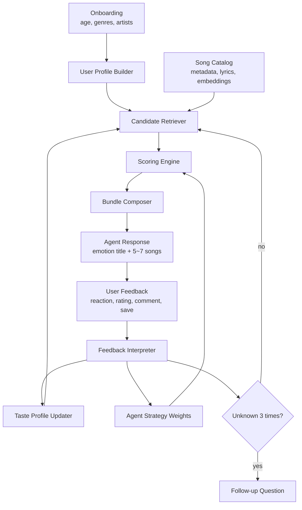

# AI Agent 기반 음악 추천 모듈 설계

## 1. 목표

이 문서는 대화형 온보딩과 사용자 피드백을 기반으로 5~7곡 단위의 음악 묶음을 추천하는 모듈 구조를 정리한다.

추천 모듈은 다음을 목표로 한다.

- 회원/비회원 모두에게 초기 취향 기반 추천을 제공한다.
- 곡을 감성 타이틀로 묶어 앨범아트, 30초 미리듣기와 함께 제시한다.
- 사용자의 반응, 별점, 코멘트를 다음 추천에 반영한다.
- `몰라요` 반응이 3회 연속 발생하면 추천보다 질문을 우선해 취향 단서를 보강한다.
- 보관함 저장 이력을 장기 선호 신호로 반영한다.

## 2. 전체 구조



## 3. 단계별 설명

### 3.1 온보딩 입력 수집

사용자가 앱을 열면 Agent가 나이, 선호 장르, 선호 가수를 대화형으로 수집한다. 회원은 기존 프로필과 병합하고, 비회원은 세션 프로필로 유지한다.

입력 예시:

```json
{
  "user_id": "user_123",
  "session_id": "sess_abc",
  "age": 24,
  "preferred_genres": ["댄스", "R&B"],
  "preferred_artists": ["NewJeans", "태연"],
  "free_text": "밤에 산책할 때 들을 노래가 좋아요"
}
```

출력 예시:

```json
{
  "user_profile": {
    "age": 24,
    "genre_preferences": {"댄스": 1.0, "R&B": 1.0},
    "artist_preferences": {"NewJeans": 1.0, "태연": 1.0},
    "mood_keywords": ["밤", "산책"],
    "familiarity_preference": 0.5,
    "preferred_year_center": null,
    "strategy_weights": {
      "w_theme": 0.50,
      "w_era": 0.20,
      "w_discovery": 0.20,
      "w_quality": 0.10
    }
  }
}
```

초기 `preferred_year_center`는 온보딩 입력으로 받지 않는다. 추천 모듈이 `age`로 출생연도를 추정하고, 데이터 범위 2000~2025년에서의 `user_age_at_release` 중간값을 다시 연도로 환산해 계산한다. 피드백 이후에는 업데이트된 중심 연도를 세션에 저장해 다음 추천에 사용한다.

### 3.2 곡 카탈로그 구성

스크래핑/수집 데이터는 추천 후보군의 원천 데이터로 사용한다. 현재 카탈로그의 기본 필드는 다음과 같다.

```json
{
  "songId": "12345",
  "title": "Song Title",
  "artists": [{"artistId": "678", "name": "Artist"}],
  "album": {"albumId": "999", "name": "Album"},
  "releaseDate": "2025.01.01",
  "genres": ["댄스"],
  "likeCount": 12000,
  "lyrics": "lyrics text",
  "chartAppearances": [{"year": 2025, "rank": 10}],
  "sourceUrls": {
    "chart": "https://...",
    "detail": "https://..."
  }
}
```

서비스 응답에는 다음 필드를 추가로 붙인다.

```json
{
  "album_art_url": "https://...",
  "preview_url": "https://...",
  "audio_features": {
    "tempo": 118,
    "energy": 0.76,
    "valence": 0.62
  },
  "embeddings": {
    "song": [0.01, -0.03],
    "lyrics": [0.04, 0.12],
    "metadata": [0.08, -0.02]
  }
}
```

### 3.3 사용자 취향 프로필 생성

온보딩 텍스트, 선호 장르, 선호 가수, 저장/별점/반응 이력을 하나의 사용자 취향 벡터로 만든다.

권장 구성:

- `genre_vector`: 장르 선호 벡터
- `artist_vector`: 아티스트 선호 벡터
- `mood_vector`: 대화/코멘트에서 추출한 감성 키워드 임베딩
- `positive_song_vector`: 높은 별점 또는 저장한 곡의 평균 임베딩
- `negative_song_vector`: 낮은 별점 또는 싫어한 곡의 평균 임베딩

사용자 벡터:

```text
user_vector =
  0.30 * onboarding_vector
+ 0.30 * positive_song_vector
+ 0.20 * mood_vector
+ 0.15 * artist_vector
+ 0.05 * genre_vector
- 0.20 * negative_song_vector
```

### 3.4 후보 곡 검색

전체 곡 중 사용자 프로필과 유사한 곡을 넓게 검색한다. 처음부터 5~7곡만 뽑지 않고, 50~200곡 정도의 후보군을 만든 뒤 점수화한다.

입력:

```json
{
  "user_vector": [0.11, -0.04],
  "profile": {
    "genre_preferences": {"R&B": 1.0},
    "artist_preferences": {"태연": 1.0},
    "familiarity_preference": 0.5
  },
  "exclude_song_ids": ["111", "222"],
  "limit": 100
}
```

출력:

```json
{
  "candidates": [
    {
      "song_id": "12345",
      "retrieval_reason": ["vector_similarity", "genre_match"],
      "raw_similarity": 0.82
    }
  ]
}
```

### 3.5 추천 점수 산출

v1.1은 온보딩 정보로 후보를 먼저 좁힌 뒤, 테마 적합도, 시대 적합도, 발견성, 품질 점수, 패널티를 합산한다. 장르/아티스트 선호는 점수 보너스가 아니라 사전 필터링에 사용한다.

```text
final_score =
  w_theme * theme_score
+ w_era * era_score
+ w_discovery * discovery_score
+ w_quality * quality_score
- penalties
```

초기 가중치:

```json
{
  "w_theme": 0.50,
  "w_era": 0.20,
  "w_discovery": 0.20,
  "w_quality": 0.10
}
```

세부 점수 정의:

```text
theme_score =
  cosine(current_theme_vector, song_mood_vector)
```

```text
era_score =
  score_by_distance(release_year, preferred_year_center)
```

```text
discovery_score =
  1 - familiarity_score
```

```text
quality_score =
  normalized(log(1 + like_count))
  + chart_bonus
  + metadata_completeness_bonus
```

```text
penalties =
  duplicate_artist_penalty
+ recently_seen_penalty
+ too_obscure_penalty
+ disliked_similarity_penalty
```

점수 산출 결과 예시:

```json
{
  "song_id": "12345",
  "final_score": 0.783,
  "scores": {
    "theme": 0.91,
    "era": 0.84,
    "discovery": 0.72,
    "quality": 0.80,
    "penalties": 0.04
  },
  "slot_type": "theme_match"
}
```

### 3.6 5~7곡 묶음 구성

점수가 높은 곡만 나열하면 추천이 단조로워질 수 있으므로 슬롯을 나눠 구성한다.

권장 슬롯:

- `anchor`: 사용자가 알 가능성이 높은 안정적인 곡
- `theme_match`: 현재 감성 타이틀에 가장 잘 맞는 곡
- `artist_adjacent`: 선호 가수와 유사하거나 연관된 가수의 곡
- `genre_expand`: 선호 장르를 살짝 확장한 곡
- `discovery`: 낯설지만 취향에 맞을 가능성이 있는 곡
- `wildcard`: Agent가 맥락상 실험적으로 제안하는 곡

출력 예시:

```json
{
  "bundle_id": "bundle_001",
  "emotion_title": "밤 산책에 어울리는 부드러운 R&B",
  "songs": [
    {
      "song_id": "12345",
      "title": "Song Title",
      "artists": ["Artist"],
      "album_art_url": "https://...",
      "preview_url": "https://...",
      "slot_type": "theme_match",
      "recommendation_reason": "밤 산책이라는 단서와 가사 분위기가 잘 맞아요.",
      "score_breakdown": {
        "theme": 0.91,
        "era": 0.84,
        "discovery": 0.72,
        "quality": 0.80
      }
    }
  ]
}
```

### 3.7 피드백 해석

사용자는 곡마다 `알아요`, `듣고 싶어요`, `몰라요`, 별점, 선택 코멘트, 보관함 저장 여부를 남긴다. 시대 선호 조정 여부는 추천 모듈이 코멘트를 직접 해석하지 않고 agent 모듈이 판단한다. agent는 피드백 처리 시 `era_shift`를 `-n`, `0`, `n` 형식의 숫자로 넘긴다.

`era_shift` 의미:

| 값 | 의미 |
| --- | --- |
| `0` | 초기 `preferred_year_center` 또는 현재 값을 유지 |
| `-n` | `preferred_year_center`를 `n`년 낮춤 |
| `n` | `preferred_year_center`를 `n`년 높임 |

입력 예시:

```json
{
  "user_id": "user_123",
  "bundle_id": "bundle_001",
  "era_shift": -4,
  "song_id": "12345",
  "reaction": "듣고 싶어요",
  "rating": 5,
  "comment": "이런 분위기 더 듣고 싶어요",
  "saved": true,
  "score_breakdown": {
    "theme": 0.91,
    "era": 0.84,
    "discovery": 0.72,
    "quality": 0.80
  },
  "slot_type": "theme_match"
}
```

반응별 해석:

| 반응 | 별점 | 해석 | 다음 추천 반영 |
| --- | --- | --- | --- |
| 알아요 | 높음 | 익숙하고 취향에도 맞음 | `anchor`, `safe_match` 유지 또는 증가 |
| 알아요 | 낮음 | 익숙하지만 취향은 아님 | 해당 아티스트/장르/시대 약화 |
| 듣고 싶어요 | 높음 | 테마와 발견성 모두 긍정 | 비슷한 가사/무드 확장 |
| 몰라요 | 높음 | 낯설지만 흥미 있음 | `discovery` 슬롯 증가 |
| 몰라요 | 낮음 | 너무 낯설거나 취향과 멂 | 발견성 감소, `too_obscure_penalty` 증가 |

`몰라요`가 3회 연속이면 다음 추천을 바로 생성하지 않고 꼬리 질문으로 전환한다.

```json
{
  "type": "follow_up_question",
  "reason": "unknown_reaction_streak",
  "question": "조금 더 익숙한 곡 위주로 추천해드릴까요, 아니면 새로운 곡을 계속 섞어볼까요?"
}
```

### 3.8 취향 프로필 업데이트

별점은 `-1`부터 `+1`까지의 신호로 변환한다.

```text
rating_signal = (rating - 3) / 2
```

예시:

| 별점 | rating_signal |
| --- | --- |
| 1 | -1.0 |
| 2 | -0.5 |
| 3 | 0.0 |
| 4 | 0.5 |
| 5 | 1.0 |

곡 선호 벡터 업데이트:

```text
positive_song_vector =
  moving_average(positive_song_vector, song_vector, alpha)
```

```text
negative_song_vector =
  moving_average(negative_song_vector, song_vector, alpha)
```

업데이트 기준:

- `rating_signal > 0` 또는 `saved = true`: 긍정 벡터에 반영
- `rating_signal < 0`: 부정 벡터에 반영
- `comment`가 있으면 코멘트 임베딩을 `mood_vector`에 약하게 반영
- `era_shift`가 있으면 `preferred_year_center = clamp(preferred_year_center + era_shift, 2000, 2025)`로 업데이트

### 3.9 추천 전략 가중치 반영

v1.1에서는 추천 모듈이 별점으로 전략 가중치를 직접 학습하지 않는다. Agent Orchestrator가 대화 맥락과 피드백을 해석해 다음 추천의 `strategy_weights`를 결정한다.

추천 모듈은 Agent가 넘긴 full weight를 검증하고 합이 1이 되도록 정규화한 뒤 `final_score`에 사용한다.

```json
{
  "w_theme": 0.50,
  "w_era": 0.20,
  "w_discovery": 0.20,
  "w_quality": 0.10
}
```

허용 정책:

- 정확히 `w_theme`, `w_era`, `w_discovery`, `w_quality` 네 개 key만 허용한다.
- 음수 값은 허용하지 않는다.
- 합이 0이면 오류로 처리한다.
- 합이 1이 아니면 추천 모듈 내부에서 정규화한다.

## 4. 임베딩 설계

> v1 구현 메모: 현재 구현은 곡의 가사만 `solar-embedding-1-large-passage`로 임베딩하고, 사용자의 `free_text`만 `solar-embedding-1-large-query`로 임베딩한다. `mood_keywords`, 장르, 가수는 query embedding에 섞지 않는다. `free_text`가 비어 있으면 fallback 없이 추천 입력 오류를 반환한다.

### 4.1 곡 임베딩

곡 임베딩은 가사, 메타데이터, 오디오 특징을 합쳐 만든다.

```text
song_vector =
  0.50 * lyrics_embedding
+ 0.25 * metadata_embedding
+ 0.15 * artist_genre_embedding
+ 0.10 * audio_feature_embedding
```

메타데이터 텍스트 예시:

```text
title: Ditto
artists: NewJeans
album: OMG
genres: 댄스, R&B
releaseDate: 2022.12.19
```

### 4.2 테마 임베딩

Agent가 생성한 감성 타이틀과 현재 대화 단서를 합쳐 테마 벡터를 만든다.

```text
current_theme_text =
  emotion_title + onboarding_free_text + recent_positive_comments
```

```text
current_theme_vector = embedding(current_theme_text)
```

### 4.3 발견성 계산

발견성은 사용자가 이미 알 가능성이 낮지만, 취향과 완전히 동떨어지지 않은 곡을 찾기 위한 점수다.

```text
familiarity_score =
  0.40 * artist_familiarity
+ 0.25 * chart_popularity
+ 0.20 * genre_familiarity
+ 0.15 * previously_seen_similarity
```

```text
discovery_score =
  clamp(1 - familiarity_score, 0, 1)
```

단, 너무 낯선 곡은 패널티를 준다.

```text
too_obscure_penalty =
  max(0, discovery_score - user_discovery_tolerance) * 0.2
```

## 5. 추천 API 초안

### 5.1 추천 요청

```json
{
  "user_id": "user_123",
  "session_id": "sess_abc",
  "context": {
    "onboarding_completed": true,
    "last_bundle_id": "bundle_001",
    "unknown_streak": 0
  },
  "profile": {
    "age": 24,
    "preferred_year_center": null,
    "preferred_genres": ["R&B"],
    "preferred_artists": ["태연"],
    "mood_keywords": ["밤", "산책"],
    "strategy_weights": {
      "w_theme": 0.50,
      "w_era": 0.20,
      "w_discovery": 0.20,
      "w_quality": 0.10
    }
  },
  "options": {
    "bundle_size": 6,
    "include_preview": true,
    "include_album_art": true
  }
}
```

### 5.2 추천 응답

```json
{
  "bundle_id": "bundle_002",
  "emotion_title": "새벽 공기처럼 차분한 K-pop",
  "songs": [
    {
      "song_id": "12345",
      "title": "Song Title",
      "artists": ["Artist"],
      "album": "Album",
      "album_art_url": "https://...",
      "preview_url": "https://...",
      "slot_type": "theme_match",
      "reason": "최근 긍정 반응을 보인 부드러운 R&B 무드와 유사합니다.",
      "score_breakdown": {
        "theme": 0.88,
        "era": 0.84,
        "discovery": 0.41,
        "quality": 0.79,
        "final": 0.76
      }
    }
  ],
  "next_action": "collect_feedback"
}
```

### 5.3 피드백 요청

```json
{
  "user_id": "user_123",
  "session_id": "sess_abc",
  "bundle_id": "bundle_002",
  "era_shift": -4,
  "feedbacks": [
    {
      "song_id": "12345",
      "reaction": "듣고 싶어요",
      "rating": 5,
      "comment": "이런 분위기가 좋아요",
      "saved": true
    }
  ]
}
```

### 5.4 피드백 처리 응답

```json
{
  "updated_profile_summary": {
    "strengthened": ["R&B", "차분한 무드", "밤"],
    "weakened": [],
    "preferred_year_center": 2008.5,
    "unknown_streak": 0
  },
  "next_action": "recommend_next_bundle"
}
```

추천 모듈 내부에서는 피드백 처리를 하나의 함수로 호출한다.

```python
from ai.recommender.feedback import process_feedback

updated_profile = process_feedback(
    feedbacks=feedbacks,
    preferred_year_center=current_profile.preferred_year_center,
    age=current_profile.age,
    era_shift=-4,
    previous_unknown_streak=current_profile.unknown_streak,
)
```

초기 피드백처럼 `current_profile.preferred_year_center`가 아직 없으면 추천 모듈이 `age`로 기준 연도를 계산한 뒤 `era_shift`를 적용한다. `updated_profile.preferred_year_center`는 다음 `RecommendationRequest`의 내부 세션 상태로 전달한다. 다음 `strategy_weights`는 Agent가 별도로 계산해 전달한다.

## 6. 구현 우선순위

1. 곡 카탈로그 정규화: `songId`, 제목, 아티스트, 앨범, 장르, 가사, 인기도 필드 정리
2. 곡 임베딩 생성: 가사/메타데이터 기반 `song_vector` 저장
3. 온보딩 프로필 생성: 나이, 장르, 가수, 자유 텍스트를 사용자 벡터로 변환
4. 후보 검색: 벡터 유사도 기반 Top-N 후보 추출
5. 점수 엔진: `theme`, `era`, `discovery`, `quality`, `penalty` 계산
6. 묶음 구성: 5~7곡 슬롯 기반 추천 응답 생성
7. 피드백 반영: 별점/반응/코멘트/저장 여부로 프로필 상태 업데이트
8. 꼬리 질문 전환: `몰라요` 3연속 처리

## 7. 핵심 설계 원칙

- 별점으로 가중치를 직접 크게 바꾸지 않는다.
- 추천 전략 가중치 결정은 Agent 책임으로 분리한다.
- 추천은 점수 상위 곡만 고르지 않고 슬롯 기반으로 다양성을 확보한다.
- `몰라요`는 부정 신호가 아니라 낯섦 신호일 수 있으므로 별점과 함께 해석한다.
- 비회원도 세션 단위 프로필을 유지해 3~5회 반복 추천이 자연스럽게 개선되도록 한다.
