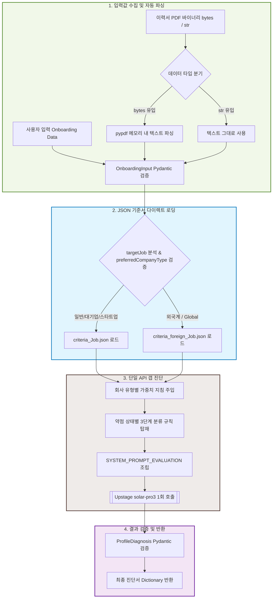

# 에이전트 1 (Profile Diagnosis Agent) 상세 명세서 및 가이드

본 문서는 **CareerMate** 프로젝트의 핵심 진단 엔진인 **에이전트 1 (프로필 진단 에이전트)**의 아키텍처, 기능 명세, API 규격, 그리고 프롬프트 설계 사상을 상세하게 기록한 개발자 가이드입니다.

---

## 1. 에이전트 요약 (Agent Summary)

**Profile Diagnosis Agent(에이전트 1)**는 사용자가 회원가입/온보딩 과정에서 입력한 정보와 이력서 텍스트(PDF 자동 파싱 결과)를 목표 직무의 **"100점짜리 기준 역량(JSON 기준서)"**과 대조 분석하여, 개인화된 프로필 진단서(`ProfileDiagnosis`)를 발행하는 AI 에이전트입니다.

* **핵심 목적**: 목표 직무 기준 대비 구직자가 만족하는 강점과 보완해야 할 구체적인 약점의 격차(Gap)를 판단하고, 이력서 원문에서 팩트 기반의 현재 보유 기술 스택(`owned_skills`)을 추출하여 하위 로드맵 설계 에이전트의 핵심 기초 데이터를 제공합니다.
* **추론 모델**: Upstage `solar-pro3` (OpenAI 호환 API)
* **설계 특징**: 중복되던 1단계 LLM 분석 연산을 완전히 제거하고, **로컬 정적 JSON 기준서 로딩** 방식을 탑재하여 단 1회의 API 호출로 20초 이내에 모든 진단을 안전하게 완료합니다.

---

## 2. 제공 기능 (Key Features)

### A. 로컬 JSON 기준 역량(`ref_criteria/`) 로딩
* 직무별(Backend, Frontend, ML, Data, DevOps, AI Product 등) 및 회사 유형별(일반 vs 외국계)로 미리 도출된 100점짜리 공통 필수 역량(`common_requirements`) JSON 기준 데이터를 디스크에서 즉시 로드합니다.
* 중복되는 RAG 분석 API 호출을 생략(Skip)함으로써 서버 지연(Latency)과 토큰 요금을 획기적으로 개선합니다.

### B. 희망 회사 유형별 가중치 평가 (Evaluation Bias)
* **대기업/중견기업**: CS 기초 지식(자료구조, 알고리즘, OS, 네트워크, 데이터베이스), 소프트웨어 공학 표준 원칙, 테스트 커버리지, 대규모 트래픽 분산 처리 및 확장성(Scalability) 역량을 우선적으로 점검합니다.
* **스타트업**: 빠른 프로토타이핑 능력, 주도적 기능 배포 및 오너십, 최신 트렌디한 기술 스택 연동, 린(Lean) 개발 방식 및 사용자 피드백 반영 역량을 우선 평가합니다.
* **외국계/글로벌 기업**: 글로벌 협업 경험, 영문 문서화 및 커뮤니케이션 능력, 오픈소스 기여 경험, 개발 자율성(Autonomy), Clean Code 및 TDD 방법론 준수 여부를 집중 진단합니다.

### C. 약점 구체화 판정 및 상태 분류 접미사 강제
약점을 기계적으로 지어내거나 모호하게 표현하지 않고, 사용자의 역량 수준에 맞춰 구체적인 접미사 단어로 상태를 구분하여 리포트를 발행합니다.
* **경험 부재**: 사용자가 해당 기준 역량을 전혀 언급하지 않았거나 경험이 아예 없는 경우.
  * *예시*: `"CI/CD 자동화 경험 부재"`, `"분산 아키텍처 설계 경험 부재"`
* **단순 나열 수준**: 이력서의 기술 스택 칸에 텍스트로만 나열되어 있고, 상세 프로젝트 구현 내용이 없어 실무 활용도를 증명할 수 없는 경우.
  * *예시*: `"Docker 단순 나열에 그침 (깊이 부족)"`, `"Redis 활용 단순 나열에 그침"`
* **경험 있으나 깊이 부족**: 프로젝트에서 다루어 보았으나 기초적인 Tutorial/CRUD 수준에 머무르고 성능 개선이나 깊이 있는 고민이 결여된 경우.
  * *예시*: `"TDD 구현 경험 있으나 깊이 부족"`, `"데이터베이스 성능 개선 경험 있으나 깊이 부족"`

### D. 영-한 크로스-링구얼 의미 매핑 (Cross-Lingual Semantic Mapping)
* 영문 글로벌 기준 역량(예: `Test-Driven Development`)과 사용자 이력서의 한글 서술(예: `테스트 코드 작성`) 간의 의미적 일치성을 추론 엔진이 지능적으로 대조함으로써, 사소한 단어 차이로 강점이 약점으로 오진되는 현상을 방지합니다.

---

## 3. Input & Output 데이터 정의 (Interface Schema)

### A. 입력 값 (Input Parameters)
* **호출 시그니처**: `async def default(self, major: str, currentStatus: str, interests: list[str], targetJob: str, preferredCompanyType: str, availableTime: str, concerns: list[str], resumeText: Union[str, bytes] = "") -> dict`

| 변수명 | 데이터 타입 | 필수 여부 | 설명 | 예시 |
| :--- | :--- | :---: | :--- | :--- |
| `major` | `str` | 필수 | 사용자의 대학 전공 및 학년 정보 | `"컴퓨터공학과"` |
| `currentStatus` | `str` | 필수 | 현재 구직 상태 혹은 신분 | `"대학 졸업생"`, `"학생 (재학 중)"` |
| `interests` | `list[str]` | 필수 | 관심 기술 분야 리스트 | `["Backend", "Database"]` |
| `targetJob` | `str` | 필수 | 목표로 하는 구체적 IT 직무 | `"Backend Engineer"`, `"AI Product Engineer"` |
| `preferredCompanyType`| `str` | 필수 | 선호하는 기업 유형 (대기업/스타트업/외국계) | `"대기업"`, `"스타트업"`, `"외국계"` |
| `availableTime` | `str` | 필수 | 주당 학습 또는 취업 준비 가용 시간 | `"20시간 이상"` |
| `concerns` | `list[str]` | 필수 | 현재 구직자가 가지고 있는 취업 고민 리스트 | `["대용량 트래픽 경험 부족", "CS 면접 대비 걱정"]`|
| `resumeText` | `Union[str, bytes]`| 선택 | 이력서 텍스트 문자열(`str`) 또는 업로드된 PDF 파일 바이너리 데이터(`bytes`). `bytes` 인입 시 내부 메모리 상에서 `pypdf`를 통해 자동으로 텍스트를 추출하여 수행합니다. | `b'%PDF-1.4 ...'` (바이너리 바이트) |

### B. 반환 값 (Output JSON Dictionary)
최종 반환 딕셔너리는 Pydantic 모델 `ProfileDiagnosis` 검증을 성공적으로 완료한 후 반환됩니다.

| 필드명 | 데이터 타입 | 설명 |
| :--- | :--- | :--- |
| `summary` | `str` | 전공, 이력서 스펙, 직무 일치도 및 고민을 종합적으로 고려하여 취업 현주소를 2-3문장으로 요약한 정성 진단서 |
| `strengths` | `list[str]` | 기준 역량과 대조 시 사용자가 명확히 보유하고 있는 상대적 강점 리스트 (접미사 포맷팅 반영, 30자 이내) |
| `weaknesses` | `list[str]` | 기준 역량과 대조 시 사용자가 반드시 보완해야 할 상태별 약점 리스트 (접미사 포맷팅 반영, 30자 이내) |
| `owned_skills` | `list[str]` | 이력서 텍스트와 온보딩 정보에서 순수 팩트 기반으로 추출된 사용자의 보유 기술 스택 목록 |
| `evidence` | `dict[str, str]` | `strengths` 및 `weaknesses`에 나열된 각 진단 항목들의 판단 근거가 된 입력 팩트(원본 텍스트 일부) 매핑 정보 |

---

## 4. Flow Chart (동작 메커니즘 흐름도)

에이전트 1의 입력 수신부터 단일 API 및 로컬 캐시를 거쳐 최종 결과를 반환하기까지의 전체 아키텍처 흐름은 다음과 같습니다.

---

## 5. 프롬프트 핵심 내용 (Prompting Philosophy)

### 사용자 맞춤 정성 진단 프롬프트 (`SYSTEM_PROMPT_EVALUATION`)
* **역할 규정**: 커리어메이트 커리어 코치 및 프로필 진단가.
* **평가 편향(Bias) 지침**: 대기업/스타트업/외국계 지향점에 따라 약점 판정의 허들을 다르게 조율하여 불필요한 과부하를 줄입니다.
* **약점 등급 구분**: 갭을 단순히 나열하지 않고 **경험 부재, 단순 나열, 깊이 부족**의 세 가지 상태 단어를 명시적으로 표기하게 유도합니다.
* **크로스 링구얼 규칙**: 영어 기준 역량과 한국어 사용자 스펙 정보 사이의 의미적 교차 검토를 지원합니다.
* **환각 방지 룰**: 이력서에 명시되지 않은 기술 스택을 보유 스택(`owned_skills`)에 얹는 행위를 차단하고, 매 판정마다 `evidence`를 매핑해 투명성을 확보합니다.
