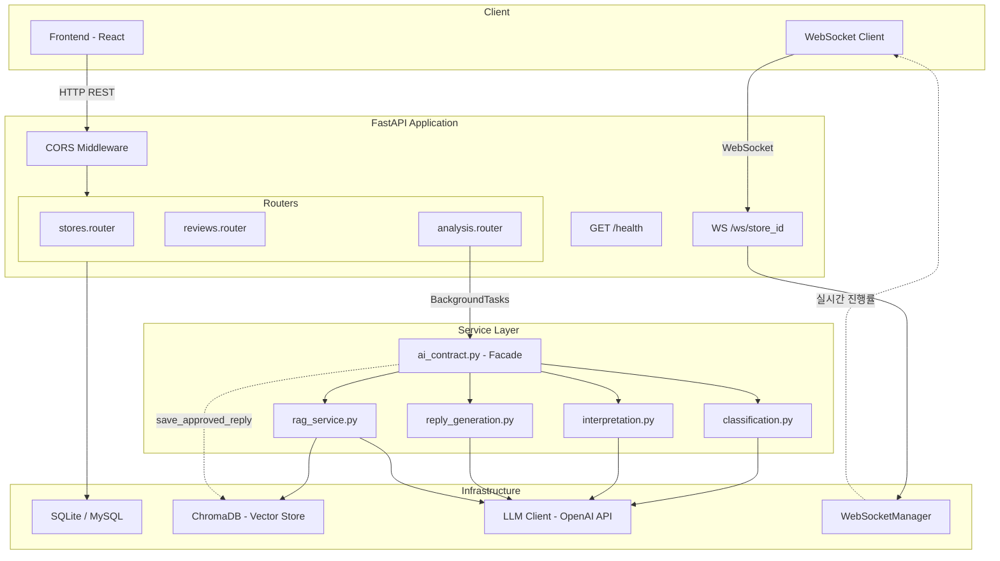
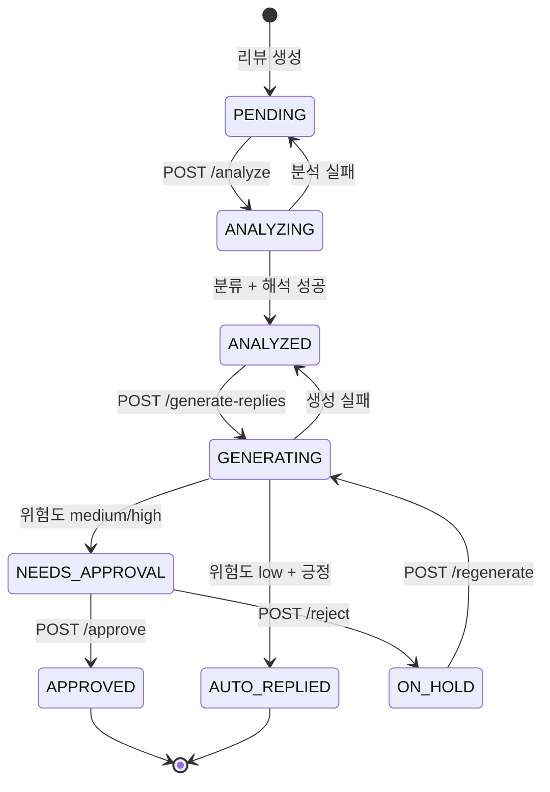
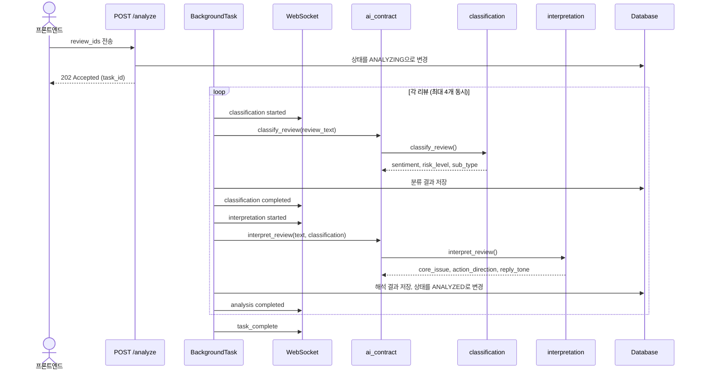
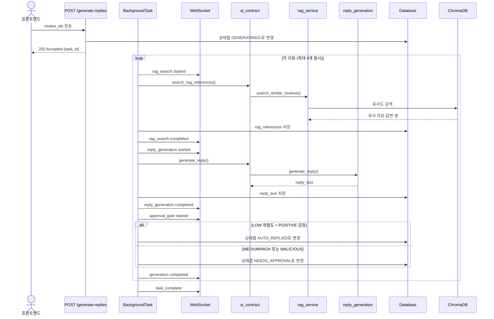
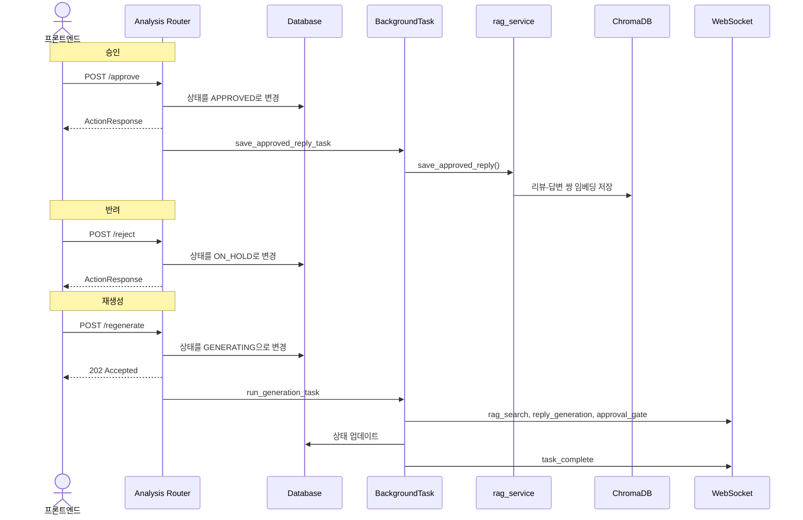

# 리뷰 대응 에이전트

소상공인 음식점 사장님의 리뷰 관리 부담을 줄이기 위한 로컬 데모용 MVP입니다. 리뷰를 주문 유형별로 모아 보고, AI가 긍정/부정/악성 및 위험도를 분류한 뒤 RAG 기반 답변 초안을 생성합니다.

## 범위

- 포함: 가게 등록, 리뷰 대시보드, 리뷰 통계, 배치 분석, 배치 답변 생성, 승인/반려/재생성, WebSocket 진행률
- 제외: 실제 플랫폼 크롤링, 실제 답변 게시, 환불 처리, 로그인/인증, 다중 가게, 배포
- 데모 가게 id는 `1`로 고정합니다. 서버 시작 시 기본 설정으로 DB를 초기화하고 시드 리뷰를 미분석 상태로 다시 넣습니다.

## 환경 설정

루트에서 `.env.example`을 복사한 뒤 필요한 값만 수정합니다.

```bash
cp .env.example .env
```

핵심 env 값:

- `DATABASE_URL`: FastAPI가 접속할 DB URL입니다. 기본값은 Docker MySQL 컨테이너 기준입니다.
- `RESET_DATABASE_ON_STARTUP`: `true`면 백엔드 시작 때 테이블을 다시 만들고 시드 데이터를 넣습니다.
- `SEED_ON_STARTUP`: `true`면 `backend/app/seed/seed_data.json`의 가게/리뷰 데이터를 넣습니다.
- `SEED_RAG_ON_STARTUP`: `true`면 RAG 참고 예시를 시작 후 비동기로 저장합니다.
- `AI_MODE`: `mock` 또는 `live`만 허용합니다.
- `UPSTAGE_API_KEY`: `AI_MODE=live`일 때 필수입니다.
- `VITE_API_BASE_URL`: 프론트가 호출할 REST API 주소입니다. 기본값은 `http://localhost:8000/api/v1`입니다.
- `VITE_WS_BASE_URL`: 프론트가 연결할 WebSocket 주소입니다. 기본값은 `ws://localhost:8000`입니다.

`AI_MODE=mock`은 외부 API 호출 없이 deterministic mock으로 동작합니다. `AI_MODE=live`는 실제 Upstage chat/embedding API를 호출합니다.

## 로컬 실행

Docker Desktop 또는 Docker daemon을 먼저 켠 뒤 MySQL을 실행합니다.

```bash
docker compose up -d mysql
# Docker Compose 플러그인이 없는 환경:
docker-compose up -d mysql
```

백엔드는 `backend` 디렉터리에 가상환경을 만들고 실행합니다.

```bash
cd backend
python3 -m venv .venv
source .venv/bin/activate
pip install -r requirements.txt
uvicorn app.main:app --reload --host 127.0.0.1 --port 8000
```

프론트는 별도 터미널에서 실행합니다.

```bash
cd frontend
npm install
npm run dev
```

접속 주소는 `http://localhost:5173`입니다. 백엔드가 꺼져 있으면 프론트는 연결 오류를 보여야 정상입니다.

Rollup optional dependency 오류가 나면 프론트 의존성을 다시 설치합니다.

```bash
cd frontend
rm -rf node_modules
npm ci
npm run dev
```

## 핵심 로직

1. 서버 시작
   `backend/app/main.py`의 lifespan이 설정에 따라 DB 테이블을 초기화하고, `backend/app/seed/seeder.py`가 데모 가게와 리뷰를 넣습니다. RAG 시드는 서버 준비 상태를 막지 않도록 백그라운드로 실행합니다.

2. 리뷰 분석
   `POST /api/v1/stores/1/reviews/analyze`는 대상 리뷰를 `analyzing`으로 바꾸고 백그라운드 작업을 시작합니다. 작업은 리뷰별로 비동기 처리되며 분류, 해석 단계마다 `/ws/1`로 진행률과 최신 리뷰 상태를 전송합니다.

3. 답변 생성
   `POST /api/v1/stores/1/reviews/generate-replies`는 `analyzed` 리뷰를 `generating`으로 바꾸고 RAG 검색, 답변 생성, 승인 게이트를 실행합니다. 낮은 위험도의 긍정 리뷰는 `auto_replied`, 나머지는 `needs_approval` 상태가 됩니다.

4. 승인 게이트
   사장님이 답변을 승인하면 `approved`로 바뀌고, 승인된 리뷰-답변 쌍은 이후 RAG 참고 사례로 저장됩니다. 반려하면 `on_hold`가 되고 재생성할 수 있습니다.

5. 프론트 실시간 반영
   `frontend/src/hooks/useWebSocket.js`는 WebSocket 메시지를 순서가 있는 큐로 보관합니다. `DashboardPage`는 도착한 메시지를 모두 처리해 리뷰 목록, 상세, 통계, 작업 상태를 즉시 갱신합니다.

## 백엔드 아키텍처

### 전체 레이어 구조



### 리뷰 상태 전이



### 분석 파이프라인

`POST /api/v1/stores/{store_id}/reviews/analyze` 호출 시:



### 답변 생성 파이프라인

`POST /api/v1/stores/{store_id}/reviews/generate-replies` 호출 시:



### 승인 / 반려 / 재생성



### API 엔드포인트

| Method | Endpoint | 설명 |
|--------|----------|------|
| `GET` | `/health` | 서버 상태 확인 |
| `WS` | `/ws/{store_id}` | 실시간 진행률 WebSocket |
| `POST` | `/api/v1/stores` | 가게 생성/갱신 |
| `GET` | `/api/v1/stores/{id}` | 가게 조회 |
| `PUT` | `/api/v1/stores/{id}` | 가게 수정 |
| `GET` | `/api/v1/stores/{id}/reviews` | 리뷰 목록 (필터+페이징) |
| `GET` | `/api/v1/stores/{id}/reviews/stats` | 리뷰 통계 집계 |
| `GET` | `/api/v1/stores/{id}/reviews/{rid}` | 리뷰 상세 |
| `POST` | `/api/v1/stores/{id}/reviews/analyze` | 배치 분석 시작 (비동기) |
| `POST` | `/api/v1/stores/{id}/reviews/generate-replies` | 배치 답변 생성 (비동기) |
| `POST` | `/api/v1/stores/{id}/reviews/{rid}/approve` | 답변 승인 |
| `POST` | `/api/v1/stores/{id}/reviews/{rid}/reject` | 답변 반려 |
| `POST` | `/api/v1/stores/{id}/reviews/{rid}/regenerate` | 답변 재생성 (비동기) |

## 검증

백엔드:

```bash
cd backend
PYTHONPATH=. .venv/bin/pytest
```

프론트:

```bash
cd frontend
npm run lint
npm test -- --run
npm run build
npm run test:e2e
```

## Gitflow

- `main`: 안정 브랜치
- `develop`: 통합 개발 브랜치
- `feature/*`: 기능 단위 작업 브랜치

각 기능은 테스트 통과 후 `develop`에 통합합니다.
