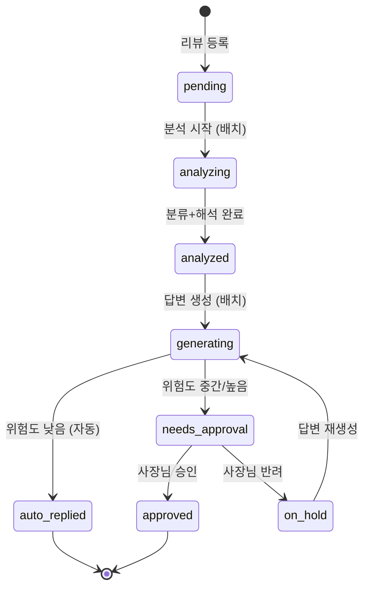
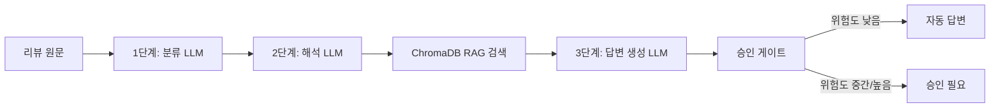

# 📋 리뷰 대응 에이전트 — 기술 스펙 문서

> **프로젝트명:** 리뷰 대응 에이전트  
> **버전:** v1.0 (MVP)  
> **작성일:** 2026-05-31  
> **참여자:** 김동연, 류승래, 최진우, 허원일

---

## 1. 프로젝트 개요

### 1.1 한 줄 정의
소상공인 사장님의 리뷰 관리 부담을 줄이기 위해, 리뷰를 자동으로 분류하고 유형에 맞는 답변 초안을 생성해주는 AI 에이전트 대시보드 서비스

### 1.2 핵심 가치
> "리뷰 유형을 AI가 판단하고, 사장님은 검토만 하면 된다"

### 1.3 대상 사용자
- 배달/홀/포장 등 플랫폼 리뷰가 쌓이는 소규모 음식점 사장님 (1~3인 운영, 가게 1개)

### 1.4 MVP 범위

| 구분 | 기능 |
|------|------|
| ✅ **필수** | 가게 정보 등록, 홀/포장/배달 탭별 리뷰 필터링 대시보드, 분류 LLM(긍정/부정/악성 + 세부 유형), 해석 LLM(핵심 이슈 + 답변 방향), RAG 기반 답변 초안 자동 생성, 승인 게이트, 통계 요약 카드 |
| 📈 **추후 확장** | 가게 원산지 정보 답변 자동 반영, 상세 리포트 페이지 |
| ❌ **제외** | 실제 크롤링, 실제 환불/게시 기능, 배포(로컬 데모), 다중 가게 관리, 로그인/인증 |

---

## 2. 시스템 아키텍처

### 2.1 기술 스택

| 구분 | 기술 | 비고 |
|------|------|------|
| **Frontend** | Vite + React | SPA 대시보드 |
| **Backend** | FastAPI (Python) | API 서버 + WebSocket |
| **Database** | MySQL | 가게 정보, 리뷰 데이터 |
| **Vector DB** | ChromaDB | RAG용 임베딩 저장소 |
| **LLM** | Upstage Solar API | 분류/해석/답변 생성 3단계 |
| **Embedding** | Upstage Embedding API | ChromaDB 임베딩용 |
| **Infra** | 로컬 실행 (여유 시 AWS EC2) | MVP는 로컬 데모 |

### 2.2 아키텍처 다이어그램


### 2.3 프로젝트 디렉토리 구조

```
review_helper/
├── frontend/                    # Vite + React
│   ├── src/
│   │   ├── components/          # 재사용 가능한 UI 컴포넌트
│   │   │   ├── ReviewCard.jsx        # 리뷰 카드 컴포넌트
│   │   │   ├── ReviewDetailPanel.jsx # 우측 상세 패널
│   │   │   ├── StatsCards.jsx        # 통계 요약 카드
│   │   │   ├── TabFilter.jsx         # 홀/포장/배달 탭
│   │   │   ├── ApprovalActions.jsx   # 승인/반려 버튼
│   │   │   └── Badge.jsx             # 범용 배지 컴포넌트
│   │   ├── pages/
│   │   │   ├── SetupPage.jsx         # 가게 정보 등록
│   │   │   └── DashboardPage.jsx     # 메인 대시보드
│   │   ├── hooks/
│   │   │   └── useWebSocket.js       # WebSocket 커스텀 훅
│   │   ├── services/
│   │   │   └── api.js                # API 호출 함수
│   │   ├── constants.js              # 상태/감정 라벨·색상 매핑 상수
│   │   ├── styles.css                # 글로벌 스타일시트
│   │   ├── App.jsx
│   │   └── main.jsx
│   ├── package.json
│   └── vite.config.js
│
├── backend/                     # FastAPI
│   ├── app/
│   │   ├── main.py                   # FastAPI 앱 엔트리포인트
│   │   ├── config.py                 # 환경 설정
│   │   ├── database.py               # DB 연결 설정
│   │   ├── demo.py                   # DEMO_STORE_ID 상수
│   │   ├── ai_contract.py            # AI 서비스 Facade (지연 로딩)
│   │   ├── openapi_examples.py       # Swagger 응답 예시
│   │   ├── models/                   # SQLAlchemy 모델
│   │   │   ├── enums.py              # OrderType, Sentiment 등 공유 Enum
│   │   │   ├── store.py
│   │   │   └── review.py
│   │   ├── schemas/                  # Pydantic 스키마
│   │   │   ├── store.py
│   │   │   └── review.py
│   │   ├── routers/                  # API 라우터
│   │   │   ├── stores.py
│   │   │   ├── reviews.py
│   │   │   ├── analysis.py
│   │   │   └── utils.py              # 공통 404/409 헬퍼, 모델→스키마 변환
│   │   ├── services/                 # 비즈니스 로직
│   │   │   ├── classification.py     # 분류 LLM
│   │   │   ├── interpretation.py     # 해석 LLM
│   │   │   ├── reply_generation.py   # 답변 생성 LLM
│   │   │   ├── rag_service.py        # ChromaDB RAG
│   │   │   └── approval_gate.py      # 승인 게이트
│   │   ├── llm/
│   │   │   ├── client.py             # Upstage API 클라이언트 + Mock 클라이언트
│   │   │   ├── prompts.py            # 시스템 프롬프트 정의
│   │   │   └── types.py              # ClassificationResult 등 내부 dataclass
│   │   ├── websocket/
│   │   │   └── manager.py            # WebSocket 매니저
│   │   └── seed/
│   │       ├── seed_data.json        # 목데이터
│   │       └── seeder.py             # DB/ChromaDB 시딩 스크립트
│   ├── requirements.txt
│   └── .env
│
└── README.md
```

---

## 3. 데이터베이스 설계

### 3.1 stores 테이블

| 컬럼명 | 타입 | 제약 조건 | 설명 |
|--------|------|-----------|------|
| `id` | INT | PK, AUTO_INCREMENT | 가게 고유 ID |
| `store_name` | VARCHAR(100) | NOT NULL | 가게 이름 |
| `origin_info` | TEXT | NULLABLE | 원산지 정보 |
| `is_dine_in` | BOOLEAN | NOT NULL, DEFAULT FALSE | 홀 운영 여부 |
| `is_takeout` | BOOLEAN | NOT NULL, DEFAULT FALSE | 포장 운영 여부 |
| `is_delivery` | BOOLEAN | NOT NULL, DEFAULT FALSE | 배달 운영 여부 |
| `created_at` | DATETIME | NOT NULL, DEFAULT NOW | 생성 시각 |

### 3.2 reviews 테이블

| 컬럼명 | 타입 | 제약 조건 | 설명 |
|--------|------|-----------|------|
| `id` | INT | PK, AUTO_INCREMENT | 리뷰 고유 ID |
| `store_id` | INT | FK → stores.id, NOT NULL | 가게 FK |
| `review_text` | TEXT | NOT NULL | 리뷰 원문 |
| `reviewer_name` | VARCHAR(50) | NULLABLE | 리뷰어 닉네임 |
| `rating` | INT | NULLABLE (1~5) | 별점 |
| `order_type` | ENUM('dine_in','takeout','delivery') | NOT NULL | 주문 유형 |
| `sentiment` | ENUM('positive','negative','malicious') | NULLABLE | 감정 분류 (LLM 결과) |
| `sub_type` | VARCHAR(50) | NULLABLE | 세부 유형 (배달지연, 이물질 등) |
| `risk_level` | ENUM('low','medium','high') | NULLABLE | 위험도 (LLM 결과) |
| `interpretation` | TEXT | NULLABLE | 해석 LLM 결과 (핵심 이슈 + 답변 방향) |
| `reply_tone` | VARCHAR(30) | NULLABLE | 답변 톤 (감사/사과/해명/단호한 대응) |
| `reply_text` | TEXT | NULLABLE | 생성된 답변 초안 |
| `status` | ENUM (아래 참조) | NOT NULL, DEFAULT 'pending' | 처리 상태 |
| `created_at` | DATETIME | NOT NULL, DEFAULT NOW | 리뷰 생성 시각 |
| `updated_at` | DATETIME | ON UPDATE NOW | 마지막 수정 시각 |

#### `status` ENUM 값 정의

| 값 | 설명 |
|----|------|
| `pending` | 미분석 (초기 상태) |
| `analyzing` | 분류+해석 LLM 처리 중 |
| `analyzed` | 분류+해석 완료, 답변 생성 대기 |
| `generating` | 답변 생성 LLM 처리 중 |
| `auto_replied` | 자동 답변 완료 (위험도 낮음) |
| `needs_approval` | 승인 필요 (위험도 중간/높음) |
| `approved` | 사장님 승인 완료 |
| `on_hold` | 반려 → 보류 상태 |

### 3.3 상태 전이도



---

## 4. API 명세

### 4.1 REST API

> 기본 경로: `/api/v1`

---

#### 4.1.1 가게 관리

##### `POST /stores` — 가게 정보 등록

**Request Body:**
```json
{
  "store_name": "맛있는 치킨집",
  "origin_info": "닭고기: 국내산, 감자: 미국산",
  "is_dine_in": true,
  "is_takeout": true,
  "is_delivery": true
}
```

**Response (201 Created):**
```json
{
  "id": 1,
  "store_name": "맛있는 치킨집",
  "origin_info": "닭고기: 국내산, 감자: 미국산",
  "is_dine_in": true,
  "is_takeout": true,
  "is_delivery": true,
  "created_at": "2026-05-31T12:00:00"
}
```

##### `GET /stores/{store_id}` — 가게 정보 조회

**Response (200 OK):** 위와 동일한 구조

##### `PUT /stores/{store_id}` — 가게 정보 수정

**Request Body:** `POST /stores`와 동일

---

#### 4.1.2 리뷰 관리

##### `GET /stores/{store_id}/reviews` — 리뷰 목록 조회

**Query Parameters:**

| 파라미터 | 타입 | 필수 | 설명 |
|----------|------|------|------|
| `order_type` | string | No | `dine_in`, `takeout`, `delivery` 중 하나 |
| `status` | string | No | 상태 필터 |
| `sentiment` | string | No | 감정 필터 |
| `page` | int | No | 페이지 번호 (기본값: 1) |
| `size` | int | No | 페이지 크기 (기본값: 20) |

**Response (200 OK):**
```json
{
  "total": 30,
  "page": 1,
  "size": 20,
  "reviews": [
    {
      "id": 1,
      "review_text": "치킨이 바삭하고 맛있어요!",
      "reviewer_name": "맛집탐방러",
      "rating": 5,
      "order_type": "delivery",
      "sentiment": "positive",
      "sub_type": null,
      "risk_level": "low",
      "status": "auto_replied",
      "reply_text": "감사합니다! 더 맛있는 치킨으로 보답하겠습니다.",
      "created_at": "2026-05-30T18:00:00"
    }
  ]
}
```

##### `GET /stores/{store_id}/reviews/{review_id}` — 리뷰 상세 조회

**Response (200 OK):**
```json
{
  "id": 1,
  "store_id": 1,
  "review_text": "배달이 1시간이나 걸렸어요. 음식도 식었고...",
  "reviewer_name": "배달고객",
  "rating": 1,
  "order_type": "delivery",
  "sentiment": "negative",
  "sub_type": "배달지연",
  "risk_level": "medium",
  "interpretation": {
    "core_issue": "배달 시간 지연으로 인한 음식 품질 하락",
    "action_direction": "진심 어린 사과와 배달 시간 개선 약속",
    "reply_tone": "사과"
  },
  "reply_text": "배달이 늦어져 불편을 드려 진심으로 죄송합니다...",
  "status": "needs_approval",
  "rag_references": [
    {
      "review": "배달이 너무 늦었어요",
      "reply": "배달 지연으로 불편을 드려 죄송합니다...",
      "similarity": 0.92
    }
  ],
  "created_at": "2026-05-30T18:00:00",
  "updated_at": "2026-05-30T18:05:00"
}
```

##### `GET /stores/{store_id}/reviews/stats` — 리뷰 통계 조회

**Query Parameters:**

| 파라미터 | 타입 | 필수 | 설명 |
|----------|------|------|------|
| `order_type` | string | No | 주문 유형별 필터 |

**Response (200 OK):**
```json
{
  "total_reviews": 30,
  "sentiment_distribution": {
    "positive": 10,
    "negative": 15,
    "malicious": 5
  },
  "risk_distribution": {
    "low": 12,
    "medium": 10,
    "high": 8
  },
  "status_distribution": {
    "pending": 5,
    "analyzed": 3,
    "auto_replied": 10,
    "needs_approval": 7,
    "approved": 4,
    "on_hold": 1
  },
  "sub_type_distribution": {
    "배달지연": 4,
    "음식맛": 4,
    "포장불량": 3,
    "이물질": 2,
    "불친절": 2,
    "환불요청": 2,
    "악성": 3
  }
}
```

---

#### 4.1.3 분석 및 답변 생성

##### `POST /stores/{store_id}/reviews/analyze` — 배치 분석 시작 (분류 + 해석)

> 선택한 리뷰들에 대해 분류 LLM → 해석 LLM을 순차 실행

**Request Body:**
```json
{
  "review_ids": [1, 2, 3, 5, 8]
}
```

**Response (202 Accepted):**
```json
{
  "task_id": "task_abc123",
  "message": "분석이 시작되었습니다. WebSocket으로 진행 상황을 확인하세요.",
  "total": 5
}
```

> [!IMPORTANT]
> 이 엔드포인트는 비동기로 동작합니다. 실제 진행률은 WebSocket을 통해 실시간으로 전달됩니다.

##### `POST /stores/{store_id}/reviews/generate-replies` — 배치 답변 생성

> 분석 완료(analyzed) 상태의 리뷰들에 대해 RAG 검색 + 답변 생성 LLM 실행

**Request Body:**
```json
{
  "review_ids": [1, 2, 3]
}
```

**Response (202 Accepted):**
```json
{
  "task_id": "task_def456",
  "message": "답변 생성이 시작되었습니다. WebSocket으로 진행 상황을 확인하세요.",
  "total": 3
}
```

##### `POST /stores/{store_id}/reviews/{review_id}/approve` — 리뷰 승인

**Response (200 OK):**
```json
{
  "id": 1,
  "status": "approved",
  "message": "답변이 승인되었습니다."
}
```

> [!NOTE]
> 승인 시 해당 리뷰-답변 쌍이 ChromaDB에 자동 저장되어 RAG 데이터로 축적됩니다.

##### `POST /stores/{store_id}/reviews/{review_id}/reject` — 리뷰 반려 (보류)

**Response (200 OK):**
```json
{
  "id": 1,
  "status": "on_hold",
  "message": "답변이 보류 처리되었습니다."
}
```

##### `POST /stores/{store_id}/reviews/{review_id}/regenerate` — 답변 재생성

> 보류(on_hold) 상태의 리뷰에 대해 답변을 다시 생성

**Response (202 Accepted):**
```json
{
  "task_id": "task_ghi789",
  "message": "답변을 다시 생성합니다."
}
```

---

### 4.2 WebSocket API

#### 연결 경로: `ws://{host}/ws/{store_id}`

#### 메시지 포맷 (서버 → 클라이언트)

**분석 진행률 업데이트:**
```json
{
  "type": "analysis_progress",
  "task_id": "task_abc123",
  "review_id": 1,
  "step": "classification",
  "status": "completed",
  "progress": {
    "current": 1,
    "total": 5,
    "percentage": 20
  }
}
```

**답변 생성 진행률 업데이트:**
```json
{
  "type": "generation_progress",
  "task_id": "task_def456",
  "review_id": 2,
  "step": "rag_search",
  "status": "completed",
  "progress": {
    "current": 1,
    "total": 3,
    "percentage": 33
  }
}
```

**리뷰 상태 변경 (단계 완료 시 최신 스냅샷 전송):**
```json
{
  "type": "review_updated",
  "task_id": "task_abc123",
  "event": "classification_completed",
  "step": "classification",
  "status": "completed",
  "review_id": 1,
  "review": { "... 최신 ReviewDetail 전체 ..." },
  "progress": {
    "current": 1,
    "total": 5,
    "percentage": 20
  }
}
```

> [!NOTE]
> `review_updated` 메시지는 DB 변경이 발생한 단계(분류 완료, 해석 완료, RAG 완료, 답변 생성 완료, 승인 게이트 완료)마다 전송됩니다. 프론트엔드는 이 메시지의 `review` 필드로 UI를 즉시 갱신합니다.

**작업 완료:**
```json
{
  "type": "task_complete",
  "task_id": "task_abc123",
  "result": "success",
  "summary": {
    "total": 5,
    "success": 5,
    "failed": 0
  }
}
```

**에러 발생:**
```json
{
  "type": "error",
  "task_id": "task_abc123",
  "review_id": 3,
  "error": "LLM 응답 파싱 실패",
  "fallback_action": "status를 pending으로 되돌렸습니다."
}
```

#### step 값 정의

| 작업 유형 | step 값 | 설명 |
|-----------|---------|------|
| 분석 | `classification` | 분류 LLM 처리 중/완료 |
| 분석 | `interpretation` | 해석 LLM 처리 중/완료 |
| 답변 생성 | `rag_search` | ChromaDB 유사 사례 검색 중/완료 |
| 답변 생성 | `reply_generation` | 답변 생성 LLM 처리 중/완료 |
| 답변 생성 | `approval_gate` | 승인 게이트 판단 중/완료 |

---

## 5. LLM 파이프라인 상세 설계

### 5.1 전체 파이프라인



> [!IMPORTANT]
> 사장님의 수동 트리거로 2단계에 걸쳐 실행됩니다:
> 1. **분석 시작** 버튼 → 1단계(분류) + 2단계(해석) 실행
> 2. **답변 생성** 버튼 → RAG 검색 + 3단계(답변 생성) + 승인 게이트 실행

### 5.2 공통 원칙
- **LLM:** Upstage Solar API (모든 단계 동일 모델)
- **Embedding:** Upstage Embedding API
- **출력 형식:** 항상 JSON으로 강제
- **감정적 표현 금지**
- **답변 최대 길이:** 500자 이내

---

### 5.3 1단계 — 분류 LLM

#### 역할
리뷰 텍스트를 읽고 감정(긍정/부정/악성), 세부 유형, 위험도를 판단

#### 시스템 프롬프트 핵심 규칙
```
당신은 음식점 리뷰 분류 전문가입니다.
주어진 리뷰를 분석하여 아래 JSON 형식으로 분류 결과를 출력하세요.

분류 기준:
- sentiment: "positive" / "negative" / "malicious"
- sub_type: (부정/악성인 경우만) "배달지연" / "이물질" / "음식맛" / "불친절" / "가격불만" / "포장불량" / "환불요청" / "기타"
- risk_level: "low" / "medium" / "high"

위험도 판단 기준:
- low: 긍정 리뷰, 단순 불만
- medium: 구체적 불만 (배달지연, 음식맛 등)
- high: 이물질, 환불요청, 욕설, 법적 언급

반드시 JSON만 출력하세요.
```

#### 입력
```json
{
  "review_text": "배달이 1시간이나 걸렸어요. 음식도 식었고..."
}
```

#### 출력
```json
{
  "sentiment": "negative",
  "sub_type": "배달지연",
  "risk_level": "medium"
}
```

---

### 5.4 2단계 — 해석 LLM

#### 역할
분류 결과를 바탕으로 리뷰의 핵심 이슈와 사장님이 취해야 할 답변 방향/톤을 결정

#### 시스템 프롬프트 핵심 규칙
```
당신은 소상공인 리뷰 대응 전략 전문가입니다.
리뷰 원문과 분류 결과를 기반으로, 핵심 이슈를 파악하고 적절한 답변 전략을 수립하세요.

답변 톤 선택지:
- "감사": 긍정 리뷰에 대한 감사 표현
- "사과": 진심 어린 사과 + 개선 의지
- "해명": 오해에 대한 정중한 해명
- "단호한 대응": 악성 리뷰에 대한 정중하되 단호한 태도

반드시 JSON만 출력하세요.
```

#### 입력
```json
{
  "review_text": "배달이 1시간이나 걸렸어요. 음식도 식었고...",
  "classification": {
    "sentiment": "negative",
    "sub_type": "배달지연",
    "risk_level": "medium"
  }
}
```

#### 출력
```json
{
  "core_issue": "배달 시간 지연으로 인한 음식 품질 하락",
  "action_direction": "진심 어린 사과와 배달 시간 개선 약속, 배달 대행 업체와의 협력 언급",
  "reply_tone": "사과"
}
```

---

### 5.5 RAG — ChromaDB 유사 사례 검색

#### 저장 데이터 구조
```json
{
  "review": "포장이 엉망이라 국물이 다 쏟아졌어요",
  "reply": "포장 상태로 불편을 드려 진심으로 사과드립니다. 포장 방법을 개선하여 이런 일이 없도록 하겠습니다.",
  "sub_type": "포장불량",
  "risk_level": "medium",
  "order_type": "delivery"
}
```

#### 검색 방식
1. 새 리뷰 텍스트를 Upstage Embedding API로 임베딩
2. ChromaDB에서 코사인 유사도 기반 상위 2~3개 사례 검색
3. 검색된 사례를 답변 생성 LLM의 컨텍스트로 전달

#### RAG 데이터 축적
- **초기 데이터:** 목데이터 20~30개 시드
- **축적 방식:** 사장님이 답변을 **승인**하면, 해당 리뷰-답변 쌍이 자동으로 ChromaDB에 저장
- 시간이 지날수록 RAG 품질이 향상되는 선순환 구조

---

### 5.6 3단계 — 답변 생성 LLM

#### 역할
해석 결과 + RAG 사례 + 가게 정보를 반영하여 답변 초안 생성

#### 시스템 프롬프트 핵심 규칙
```
당신은 소상공인 사장님을 대신하여 리뷰 답변을 작성하는 성실한 직원입니다.

톤앤매너 규칙:
- 긍정 리뷰: 따뜻하고 감사한 톤
- 부정 리뷰: 진심 어린 사과 + 개선 의지
- 악성 리뷰: 정중하되 단호한 톤, 감정적 표현 배제

작성 규칙:
- 500자 이내
- 감정적 표현 금지
- 가게 정보(가게명)를 자연스럽게 반영
- 유사 사례 답변을 참고하되 그대로 복사하지 말 것

반드시 JSON만 출력하세요.
```

#### 입력
```json
{
  "review_text": "배달이 1시간이나 걸렸어요. 음식도 식었고...",
  "interpretation": {
    "core_issue": "배달 시간 지연으로 인한 음식 품질 하락",
    "action_direction": "진심 어린 사과와 배달 시간 개선 약속",
    "reply_tone": "사과"
  },
  "store_info": {
    "store_name": "맛있는 치킨집",
    "origin_info": "닭고기: 국내산, 감자: 미국산"
  },
  "rag_references": [
    {
      "review": "배달이 너무 늦었어요",
      "reply": "배달 지연으로 불편을 드려 죄송합니다. 배달 대행 업체와 협의하여 개선하겠습니다."
    }
  ]
}
```

#### 출력
```json
{
  "reply_text": "안녕하세요, 맛있는 치킨집입니다. 배달이 늦어져 불편을 드려 진심으로 죄송합니다. 음식이 식은 상태로 도착했다니 정말 죄송하게 생각합니다. 배달 대행 업체와 긴밀히 협의하여 배달 시간을 단축하도록 개선하겠습니다. 다시 방문해 주신다면 따뜻하고 바삭한 치킨으로 보답하겠습니다. 감사합니다."
}
```

---

### 5.7 승인 게이트 로직

```python
def determine_approval(risk_level: str, sentiment: str) -> str:
    """
    위험도와 감정에 따라 자동 답변 / 승인 필요를 결정
    
    Returns:
        "auto_replied" - 자동 답변 (게시 가능 표시)
        "needs_approval" - 사장님 승인 필요
    """
    if risk_level == "low" and sentiment == "positive":
        return "auto_replied"
    elif risk_level in ("medium", "high"):
        return "needs_approval"
    elif sentiment == "malicious":
        return "needs_approval"
    else:
        return "needs_approval"  # 애매한 경우 기본값
```

---

## 6. 프론트엔드 화면 설계

### 6.1 라우팅 구조

| 경로 | 페이지 | 설명 |
|------|--------|------|
| `/setup` | SetupPage | 가게 정보 등록 (최초 1회) |
| `/dashboard` | DashboardPage | 메인 대시보드 |

- localStorage에 `store_id`를 저장
- `store_id`가 없으면 `/setup`으로 리다이렉트
- `store_id`가 있으면 `/dashboard`로 직접 진입

### 6.2 SetupPage — 가게 정보 등록

#### 구성 요소
- 가게 이름 입력 필드
- 원산지 정보 텍스트 영역
- 홀/포장/배달 운영 여부 체크박스
- 등록 버튼

#### 동작
1. 폼 입력 후 '등록' 클릭
2. `POST /api/v1/stores` 호출
3. 응답의 `id`를 localStorage에 저장
4. `/dashboard`로 리다이렉트

### 6.3 DashboardPage — 메인 대시보드

#### 레이아웃 구조

```
┌──────────────────────────────────────────────────────────────┐
│  🍗 맛있는 치킨집 리뷰 관리                    [가게 설정]    │
├──────────────────────────────────────────────────────────────┤
│  📊 통계 요약 카드                                            │
│  ┌──────┐ ┌──────┐ ┌──────┐ ┌──────────────────────────┐    │
│  │긍정 10│ │부정 15│ │악성 5 │ │ 감정별 분포 미니 차트    │    │
│  │      │ │      │ │      │ │                          │    │
│  └──────┘ └──────┘ └──────┘ └──────────────────────────┘    │
├──────────────────────────────────────────────────────────────┤
│  [전체] [홀] [포장] [배달]          [분석 시작] [답변 생성]    │
├──────────────────────────┬───────────────────────────────────┤
│  리뷰 목록 (좌측)         │  리뷰 상세 패널 (우측)             │
│  ┌──────────────────┐    │  ┌─────────────────────────────┐ │
│  │ ☑ ⭐⭐⭐⭐⭐         │    │  │ 리뷰 원문                    │ │
│  │ 🟢 긍정  🔵 낮음   │    │  │ "치킨이 바삭하고 맛있어요!"  │ │
│  │ ✅ 자동답변         │    │  │                             │ │
│  │ "치킨이 바삭하고..." │    │  │ ── 분석 결과 ──             │ │
│  └──────────────────┘    │  │ 감정: 🟢 긍정                │ │
│  ┌──────────────────┐    │  │ 위험도: 🔵 낮음              │ │
│  │ ☑ ⭐⭐             │    │  │                             │ │
│  │ 🔴 부정  🟡 중간   │    │  │ ── 해석 결과 ──             │ │
│  │ 🟡 승인필요        │    │  │ 핵심 이슈: 배달 시간 지연    │ │
│  │ "배달이 1시간..."   │    │  │ 답변 톤: 사과                │ │
│  └──────────────────┘    │  │                             │ │
│  ┌──────────────────┐    │  │ ── 답변 초안 ──              │ │
│  │ ☑ ⭐              │    │  │ "안녕하세요, 맛있는 치킨집..."│ │
│  │ ⚫ 악성  🔴 높음   │    │  │                             │ │
│  │ 🟡 승인필요        │    │  │ ── 유사 사례 ──             │ │
│  │ "사기꾼 가게..."    │    │  │ [참고 사례 1] 유사도 92%     │ │
│  └──────────────────┘    │  │ [참고 사례 2] 유사도 87%     │ │
│                          │  │                             │ │
│                          │  │    [승인]  [반려]             │ │
│                          │  └─────────────────────────────┘ │
└──────────────────────────┴───────────────────────────────────┘
```

#### 리뷰 카드 구성 요소

| 요소 | 설명 |
|------|------|
| 체크박스 | 배치 선택용 |
| 별점 | ⭐ 1~5 표시 |
| 감정 배지 | 🟢 긍정 / 🟠 부정 / 🔴 악성 (색상 구분) |
| 위험도 아이콘 | 🔵 낮음 / 🟡 중간 / 🔴 높음 |
| 처리 상태 배지 | 대기 / 분석중 / 분석완료 / 자동답변 / 승인필요 / 승인완료 / 보류 |
| 리뷰 텍스트 미리보기 | 1~2줄 요약 |
| 리뷰어 이름 | 닉네임 표시 |
| 날짜 | 리뷰 작성일 |

#### 상세 패널 — 상태별 표시 내용

| 상태 | 표시 내용 |
|------|-----------|
| `pending` | 리뷰 원문만 표시, "분석을 시작하세요" 안내 |
| `analyzing` | 리뷰 원문 + 분석 진행 중 로딩 스피너 |
| `analyzed` | 리뷰 원문 + 분석 결과 (감정/유형/위험도/해석), "답변을 생성하세요" 안내 |
| `generating` | 리뷰 원문 + 분석 결과 + 답변 생성 중 로딩 스피너 |
| `auto_replied` | 리뷰 원문 + 분석 결과 + 답변 초안(읽기 전용) + ✅ 완료 배지 |
| `needs_approval` | 리뷰 원문 + 분석 결과 + 답변 초안(읽기 전용) + 유사 사례 + [승인][반려] 버튼 |
| `approved` | 리뷰 원문 + 분석 결과 + 답변(읽기 전용) + ✅ 승인완료 배지 |
| `on_hold` | 리뷰 원문 + 분석 결과 + 이전 답변(읽기 전용) + ⏸ 보류 배지 + [답변 재생성] 버튼 |

---

## 7. 목데이터 구성

### 7.1 목데이터 분배 (총 30개)

| 유형 | 감정 | 세부 유형 | 위험도 | 개수 | 주문 유형 분배 |
|------|------|-----------|--------|------|----------------|
| 긍정 | positive | - | low | 10 | 홀3 / 포장3 / 배달4 |
| 배달지연 | negative | 배달지연 | medium | 4 | 배달4 |
| 음식맛 | negative | 음식맛 | medium | 4 | 홀2 / 포장1 / 배달1 |
| 포장불량 | negative | 포장불량 | medium | 3 | 포장2 / 배달1 |
| 이물질 | negative | 이물질 | high | 2 | 홀1 / 배달1 |
| 불친절 | negative | 불친절 | medium | 2 | 홀2 |
| 악성 | malicious | 악성 | high | 3 | 홀1 / 포장1 / 배달1 |
| 환불요청 | negative | 환불요청 | high | 2 | 배달2 |

### 7.2 목데이터 JSON 구조

```json
{
  "store": {
    "store_name": "맛있는 치킨집",
    "origin_info": "닭고기: 국내산, 감자: 미국산, 양배추: 국내산",
    "is_dine_in": true,
    "is_takeout": true,
    "is_delivery": true
  },
  "reviews": [
    {
      "review_text": "치킨이 정말 바삭하고 맛있어요! 소스도 양이 넉넉해서 좋았습니다.",
      "reviewer_name": "맛집탐방러",
      "rating": 5,
      "order_type": "delivery",
      "expected_sentiment": "positive",
      "expected_sub_type": null,
      "expected_risk_level": "low",
      "sample_reply": "안녕하세요, 맛있는 치킨집입니다! 맛있게 드셨다니 정말 기쁩니다. 항상 바삭하고 맛있는 치킨으로 보답하겠습니다. 감사합니다!"
    }
  ],
  "rag_seed_pairs": [
    {
      "review": "치킨이 정말 바삭하고 맛있어요!",
      "reply": "감사합니다! 더 맛있는 치킨으로 보답하겠습니다.",
      "sub_type": null,
      "risk_level": "low",
      "order_type": "delivery"
    }
  ]
}
```

### 7.3 시딩 프로세스

1. FastAPI 서버 시작 시 lifespan에서 `seed_data.json` 로드
2. `stores` 테이블에 가게 정보 UPSERT (이미 존재하면 필드 업데이트)
3. `reviews` 테이블에 목데이터 UPSERT (리뷰 텍스트 기준 매칭, 분석 상태를 초기화하여 `pending`으로 되돌림)
4. `rag_seed_pairs`를 서버 준비 후 **비동기 백그라운드**로 임베딩 후 ChromaDB에 저장 (서버 헬스체크를 막지 않음)

---

## 8. 제약사항 및 예외 처리

### 8.1 이번 범위에서 제외하는 것

| 항목 | 사유 |
|------|------|
| 실제 배민/네이버 크롤링 | 목데이터로 대체 |
| 실제 환불 처리 기능 | 비즈니스 로직 복잡성 |
| 플랫폼에 답변 자동 게시 | API 미지원 |
| 다중 가게 관리 | 가게 1개로 가정 |
| 로그인/인증 | MVP에서 불필요 |
| 배포 | 로컬 데모 우선 |

### 8.2 예외 처리 시나리오

| 상황 | 처리 방식 |
|------|-----------|
| LLM 분류 결과 JSON 파싱 실패 | 최대 1회 재시도 → 실패 시 status를 `pending`으로 유지, WebSocket으로 에러 알림 |
| LLM 분류 결과가 애매한 경우 | 위험도 `medium`으로 기본값 설정 → `needs_approval`로 처리 |
| RAG 유사 사례 없음 | 사례 없이 LLM 단독으로 답변 생성 (rag_references 빈 배열) |
| 답변 생성 실패 | 최대 1회 재시도 → 실패 시 빈 초안 반환, status는 `analyzed`로 유지 |
| Upstage API 타임아웃 | 30초 타임아웃 설정, 타임아웃 시 에러 반환 |
| WebSocket 연결 끊김 | 프론트엔드에서 5초 후 자동 재연결 시도 (최대 3회) |
| 목데이터 시딩 실패 | 서버 시작 실패, 에러 로그 출력 |

---

## 9. 단계별 개발 로드맵

### 1단계 (1주차 — 기반 다지기)

- [ ] 프로젝트 구조 세팅 (Vite + React, FastAPI 모노레포)
- [ ] MySQL 스키마 생성 (stores, reviews 테이블)
- [ ] 목데이터 JSON 제작 (30개 리뷰/답변 쌍)
- [ ] FastAPI 기본 서버 + DB 연결 + 시딩 스크립트
- [ ] Upstage Solar API 연동 테스트 (분류 LLM 기본 동작)
- [ ] ChromaDB 세팅 + 목데이터 임베딩 저장
- [ ] 기본 API 엔드포인트 구현 (CRUD)

### 2단계 (2주차 — 핵심 기능 구현)

- [ ] 분류 LLM + 해석 LLM + 답변 생성 LLM 파이프라인 완성
- [ ] RAG 검색 연동 (유사 사례 → 답변 생성 컨텍스트)
- [ ] 승인 게이트 로직 구현
- [ ] WebSocket 실시간 진행률 업데이트
- [ ] 프론트엔드: SetupPage, DashboardPage 기본 UI
- [ ] 프론트엔드: 리뷰 목록 + 상세 패널 + 탭 필터링
- [ ] 프론트엔드: 배치 분석/답변 생성 플로우 연동

### 3단계 (3주차 — 고도화 및 데모 준비)

- [ ] 프롬프트 튜닝 및 분류 정확도 개선
- [ ] 통계 요약 카드 (감정별 분포, 위험도 분포, 처리 상태)
- [ ] 승인 시 ChromaDB RAG 데이터 자동 축적
- [ ] 전체 플로우 통합 테스트
- [ ] UI 폴리싱 및 로딩/에러 상태 처리
- [ ] 발표 자료 및 데모 시나리오 준비

---

## 10. 성공 지표 (KPI)

| 지표 | 목표 |
|------|------|
| 리뷰 분류 정확도 | 80% 이상 |
| 답변 초안 사용 가능 수준 | 70% 이상 |
| 데모 시연 시 전체 플로우 오류 없이 동작 | 100% |
| 리뷰 30개 전체 처리 시간 | 5분 이내 |
