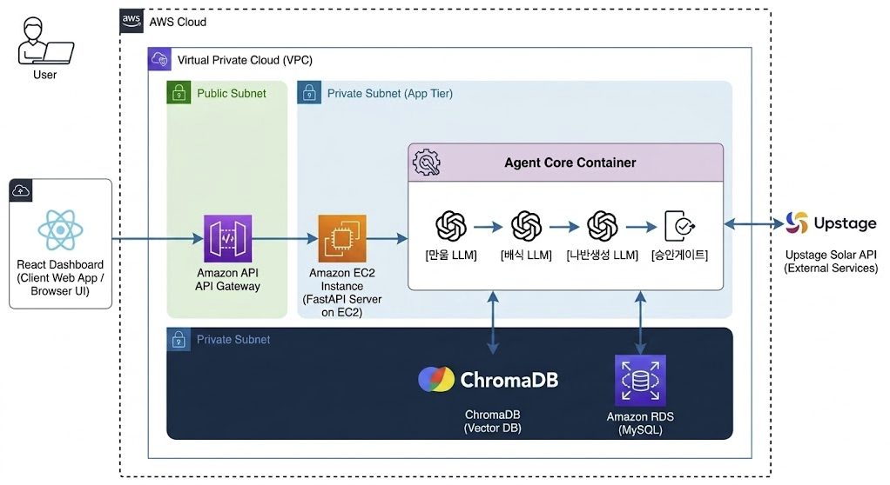

# [9조] 리뷰 대응 에이전트 프로젝트 기획서

참여자 : 김동연, 류승래, 최진우, 허원일, 이름

## 1. 문제 정의 및 프로젝트 개요

### 프로젝트 한 줄 정의

- 소상공인 사장님의 리뷰 관리 부담을 줄이기 위해, 리뷰를 자동으로 분류하고 유형에 맞는 답변 초안을 생성해주는 AI 에이전트 서비스

### 서비스 한 줄 정의

- 사장님이 리뷰를 하나하나 읽고 답변을 직접 쓰지 않아도, AI가 리뷰를 판단하고 적절한 답변 초안을 자동으로 만들어주는 대시보드 서비스

### 서비스 선정 배경

- 소상공인은 혼자 또는 소수 인원으로 가게를 운영하기 때문에 리뷰 관리에 쓸 시간이 절대적으로 부족함
- 악성 리뷰나 부정 리뷰를 읽는 것 자체가 정신적 스트레스이며, 그렇다고 무시하면 가게 평판에 직접적인 영향을 미침
- 리뷰 유형(배달 지연, 이물질, 불친절 등)에 따라 답변 전략이 달라야 하지만, 바쁜 사장님이 이를 매번 판단하기 어려움

### 해결하려는 문제

- 핵심 문제: 소상공인이 리뷰 하나하나에 성의 있는 답변을 달기 위해 소요되는 시간과 정신적 에너지가 과도함
- 리뷰가 긍정인지 부정인지, 어떤 유형의 불만인지 매번 직접 판단해야 함
- 유형별로 적절한 톤과 내용의 답변을 직접 작성해야 함
- 악성 리뷰나 환불 요청처럼 민감한 리뷰는 감정적으로 대응하기 쉬움
- 리뷰가 많을수록 답변 품질이 떨어지거나 아예 무시하게 됨

### 대상 사용자

- 배달, 홀, 포장 등 플랫폼 리뷰가 쌓이는 소규모 음식점 사장님
- 특히 1~3인 운영 매장으로, 리뷰 관리에 별도 시간을 내기 어려운 사장님
- 가게는 1개만 운영하는 것으로 가정

### 핵심 가치

- "리뷰 유형을 AI가 판단하고, 사장님은 검토만 하면 된다"
- 직접 답변을 쓰는 시간을 줄이고, 감정적 소모 없이 일관된 품질의 답변을 유지할 수 있게 함

## 2. 사용자 및 Agent 설계

### 타깃 사용자 페르소나

- 이름: 김사장 (가상)
- 연령대: 40대 초반
- 운영 형태: 배달 전문 치킨집, 혼자 운영
- 행동 특징
  - 하루 주문 50건 이상, 리뷰는 10~20개씩 쌓임
  - 스마트폰은 익숙하지만 복잡한 디지털 툴은 어려워함
  - 악성 리뷰 보면 감정적으로 대응하고 싶지만 참는 편
  - 리뷰 답변은 중요한 줄 알지만 시간이 없어서 자주 미룸

### Agent의 역할

### 에이전트는 총 3단계로 리뷰를 처리함

### 1단계 — 분류 LLM

- 리뷰를 읽고 긍정 / 부정 / 악성으로 1차 분류
- 부정 리뷰의 경우 세부 유형 분류 (배달 지연 / 이물질 / 음식 맛 / 불친절 / 가격 불만 등)
- 위험도 판단 (낮음 / 중간 / 높음)

#### 2단계 — 해석 LLM

- 분류 결과를 바탕으로 리뷰의 핵심 이슈와 사장님이 취해야 할 행동 방향 도출
- 답변 톤 결정 (감사 / 사과 / 해명 / 단호한 대응 등)

#### 3단계 — 답변 생성 LLM + 승인 게이트

- 유형과 톤에 맞는 답변 초안 자동 생성
- ChromaDB에서 유사한 과거 리뷰/답변 사례를 retrieval하여 답변 생성 시 참고 컨텍스트로 활용
- 위험도가 높은 리뷰(이물질, 환불 요청, 욕설 등)는 자동 게시 금지, 사장님 승인 필요
- 일반 긍정 리뷰는 자동 답변 가능으로 표시

### Agent의 성격 및 톤앤매너

- 사장님 입장에서 대신 답변하는 성실한 직원 페르소나
- 긍정 리뷰: 따뜻하고 감사한 톤
- 부정 리뷰: 진심 어린 사과 + 개선 의지
- 악성 리뷰: 정중하되 단호한 톤, 감정적 표현 배제

### Agent의 자율성 범위

| 기능 | 자율 실행 | 승인 필요 |
| --- | --- | --- |
| 리뷰 분류 | O |  |
| 위험도 판단 | O |  |
| 유사 사례 retrieval | O |  |
| 답변 초안 생성 | O |  |
| 일반 긍정 리뷰 답변 게시 표시 | O |  |
| 환불/이물질/악성 리뷰 답변 게시 |  | O (사장님 승인) |
| 실제 환불 처리 | 제외 (이번 범위 외) |  |

## 3. 핵심 기능 및 사용자 흐름

### 주요 사용자 시나리오

배달 치킨집 사장님 김씨는 오늘도 주문이 밀려 정신없이 하루를 보냈다. 저녁 마감 후 리뷰 대응 에이전트 대시보드를 열었다. 처음 가입할 때 배민 가게정보/원산지 정보를 등록해두었고, 홀/포장/배달 모두 운영 중으로 설정해두었다. 오늘은 배달 탭을 클릭하니 배달 주문에 달린 리뷰 14개만 리스트에 표시된다. 긍정 8개는 자동 답변 가능, 부정 4개는 배달 지연과 음식 온도 문제로 나뉘어 답변 초안이 준비되어 있다. 이물질 관련 리뷰 1개는 승인 필요로 표시되어 초안 검토 후 승인했다. 전체 처리 시간 5분.

### 핵심 기능 정의

1. 가게 정보 등록 — 가입 시 가게 이름, 원산지 정보, 홀/포장/배달 운영 여부 등록
1. 리뷰 목록 대시보드 — 홀/포장/배달 탭별로 해당 주문 유형의 리뷰만 필터링하여 표시
1. 1차 분류 — 긍정 / 부정 / 악성 자동 분류
1. 2차 분류 — 부정 리뷰의 세부 원인 분류 (배달 지연, 이물질, 불친절 등)
1. RAG 기반 답변 초안 자동 생성 — 유사한 과거 리뷰/답변 사례를 검색하여 참고한 맞춤 답변 생성
1. 승인 게이트 — 위험도 높은 리뷰는 사장님 검토 후 처리
1. 리포트 — 불만 유형 통계, 위험도 분포 요약

### 워크플로우

### 사용자 관점 워크플로우

### 1. 최초 가입 시 가게 정보 등록

- 가게 이름, 원산지 정보
- 홀 / 포장 / 배달 운영 여부 체크 (가게는 1개로 가정)

### 2. 대시보드 접속

### 3. 상단 탭에서 유형 선택 (홀 / 포장 / 배달)

### → 선택한 주문 유형에 해당하는 리뷰만 리스트에 표시

### 4. 리뷰 클릭 → 상세 분석 확인 (감정 / 이슈 / 위험도 / 정책 판단)

### 5. 자동 답변 초안 확인 (과거 유사 사례 기반)

### 6. 승인 필요 리뷰는 검토 후 승인 or 보류

### 7. 자동 답변 가능 리뷰는 바로 완료 처리

### 시스템 관점 워크플로우

### [가게 정보 등록 (가입 시 1회)] - 가게명, 원산지, 홀/포장/배달 여부 저장

↓

### [데이터 리뷰 입력]

↓

### [분류 LLM] - 긍정/부정/악성 판단, 세부 유형 분류, 위험도 판단

↓

### [해석 LLM] - 핵심 이슈 추출, 답변 전략 결정

↓

### [RAG - ChromaDB] - 유사 과거 리뷰/답변 쌍 검색, 상위 2~3개 컨텍스트 반환

↓

### [답변 생성 LLM] - 해석 결과 + RAG 사례 + 가게 정보 반영 초안 생성

↓

### [승인 게이트] - 낮음: 자동 답변 가능 / 중간·높음: 사장님 승인 필요

↓

### [대시보드 출력]

## 4. 기술 구현 설계

### 기술 스택

| 구분 | 기술 스택 | 비고 |
| --- | --- | --- |
| Frontend | React | 목데이터 기반 대시보드 |
| Backend | FastAPI (Python) | API 서버 |
| Database | MySQL | 가게 정보, 리뷰 데이터 저장 |
| LLM / Agent | Upstage Solar API | 교육 제공 API 키 사용 |
| Vector DB | ChromaDB | RAG용 벡터DB |
| Infra | AWS EC2 | 로컬 데모 우선, 여유 시 배포 |

### 시스템 아키텍처

### 프롬프트 설계 전략

- 분류 LLM: 리뷰 텍스트 입력 → JSON 형태로 분류 결과 출력 강제

{"sentiment": "부정", "type": "배달지연", "risk": "중간"}

- 해석 LLM: 분류 결과 + 리뷰 원문 입력 → 핵심 이슈와 답변 방향 출력
- 답변 생성 LLM: 해석 결과 + 가게 정보 + 답변 컨텍스트 → 답변 초안 생성
  - 매뉴얼이 몇 줄 수준이면 시스템 프롬프트에 직접 포함
  - 분량이 많거나 과거 사례 쌓인 경우 ChromaDB에서 retrieval하여 컨텍스트로 전달
- 공통 원칙: 출력은 항상 JSON으로 강제, 감정적 표현 금지, 500자 이내

### 데이터 활용 및 기억 관리 (RAG)

- 과거 리뷰와 실제 달았던 답변을 쌍(pair)으로 ChromaDB에 저장
- 새 리뷰가 입력되면 임베딩 유사도 기반으로 가장 유사한 과거 사례 2~3개 retrieval
- 검색된 사례를 답변 생성 LLM의 컨텍스트로 전달하여 참고하도록 함

{ "review": "포장이 엉망이라 국물이 다 쏟아졌어요",

"reply": "불편을 드려 진심으로 사과드립니다.",

"type": "포장불량", "risk": "중간" }

- 배달 지연, 이물질, 포장 불량, 칭찬, 환불 요청 등 유형별 샘플 리뷰/답변 쌍 20~30개 사전 제작
- 각 리뷰에 주문 유형(홀/포장/배달) 태깅 포함

### 제약사항 및 예외 처리

### 이번 범위에서 제외하는 것

- 실제 배민/네이버 크롤링 (목데이터로 대체)
- 실제 환불 처리 기능
- 배민/네이버 등 플랫폼에 답변 자동 게시 (API 미지원으로 제외)
- 다중 가게 관리 (가게 1개로 가정)

예외 처리

- LLM 분류 실패 시 → '수동 확인 필요'로 표시
- RAG 유사 사례 없을 경우 → 사례 없이 LLM 단독으로 답변 생성
- 답변 생성 실패 시 → 재시도 1회, 실패 시 빈 초안으로 반환
- 분류 결과가 애매한 경우 → 위험도 '중간'으로 기본값 설정, 승인 필요로 처리

## 5. 성과 평가 및 실행 계획

### 성공 지표 (KPI)

- 리뷰 분류 정확도 80% 이상
- 답변 초안이 사장님 검토 없이도 사용 가능한 수준 70% 이상
- 데모 시연 시 전체 플로우 (분류 → 해석 → RAG retrieval → 답변 생성 → 승인) 오류 없이 동작

### MVP 범위

### 필수 기능

- 가게 정보 등록 (가입 시 1회)
- 홀/포장/배달 탭별 리뷰 필터링 대시보드
- 분류 LLM (긍정/부정/악성 + 세부 유형)
- RAG 기반 답변 초안 자동 생성 (ChromaDB)
- 승인 게이트 (위험도별 자동/수동 분기)

추후 확장 가능 기능

- 리포트 화면 (불만 유형 통계)
- 해석 LLM 별도 분리
- 가게 원산지 정보 답변에 자동 반영

제외 기능

- 실제 크롤링
- 실제 환불/게시 기능
- 배포 (로컬 실행으로 데모)
- 다중 가게 관리

### 단계별 개발 로드맵

### 1단계 (1주차 — 기반 다지기)

- 가게 정보 등록 기능 구현
- 목데이터 제작 (유형별 리뷰/답변 쌍 20~30개, 주문 유형 태깅 포함)
- FastAPI 기본 서버 세팅
- Upstage API 연동 및 분류 LLM 기본 동작 확인
- ChromaDB 세팅 및 목데이터 임베딩 저장
- API 명세 합의 (프론트 ↔ 백엔드)

2단계 (2주차 — 핵심 기능 구현)

- 분류 LLM + 해석 LLM + 답변 생성 LLM 파이프라인 완성
- RAG retrieval 연동 (유사 사례 검색 → 답변 생성 컨텍스트 반영)
- 승인 게이트 로직 구현
- 홀/포장/배달 탭별 필터링 대시보드 UI 연동

3단계 (3주차 — 고도화 및 데모 준비)

- 프롬프트 튜닝 및 분류 정확도 개선
- 리포트 화면 추가
- 전체 플로우 통합 테스트
- 발표 자료 및 데모 시나리오 준비

### 기대 효과

- 사장님의 리뷰 답변 시간을 평균 30분 → 5분으로 단축
- 감정적 대응으로 인한 2차 분쟁 방지
- 과거 사례 기반 답변으로 일관된 품질 유지
- 소규모 사업장도 대형 브랜드 수준의 리뷰 관리 경험 제공
